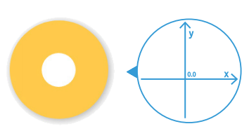
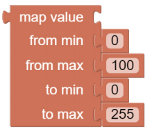
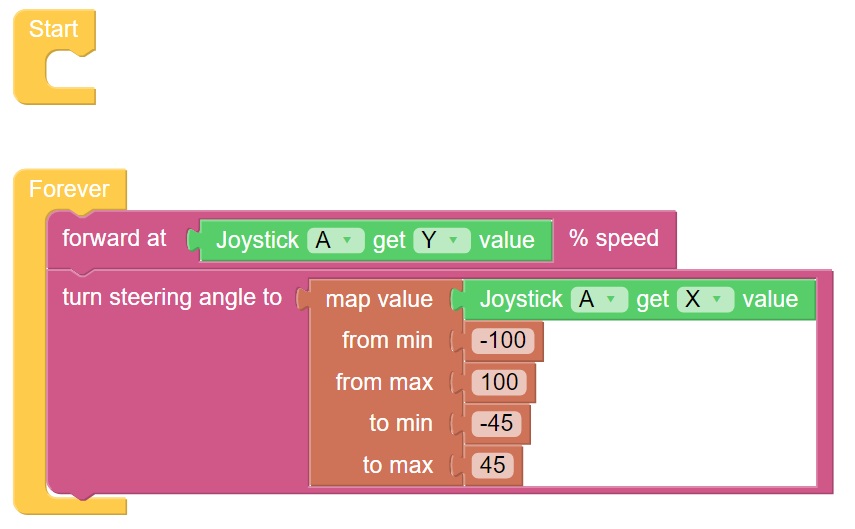

Remote Control
=======================

Next we control the PiCar-X with a tablet. You will need to use the Joystick at the 
Bluetooth control page. By the way, you need to use the "Map" function to map the 
X-axis reading of the Joystick as a suitable angle.

* `How to Use the Remote Control Function? <https://docs.sunfounder.com/projects/ezblock3/en/latest/remote.html>`_

**TIPS**

.. image:: img/block/sp210512_114004.png

To use the remote control function, you need to enter the Bluetooth Control page from the left side of main page.

Drag a Joystick to the central area. Toggle the white point in it to produce a coordinate. 
The range of the X or Y axis is "-100 ~ 100". Toggling the point to the left will result in an X value of "-100" and a Y value of "0".

This block reads the Joystick value in the Bluetooth control page. You can click the drop-down menu to switch to the Y-axis reading.

The map block can remap a number from one range to another. If a number is 50，it is at 50% position of the range of 0~100; then if we map it to the range 0~255 via the map block, the number will be 127.5.

**EXAMPLE**

