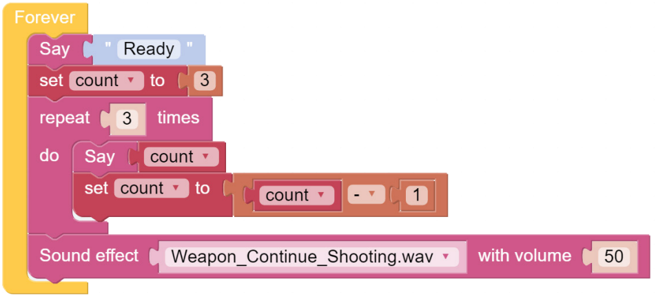

Sound Effect
===============================

PiCar-X can make voice. You can enter text to make it speak, or make specific sound effects. Let us fire a gun as soon as a 3s countdown stops.

**TIPS**

.. image:: img/block/sp210512_144106.png

Write the sentence in this block, and PiCar-X will say it. It can be used with Text.

A number block.

.. image:: img/block/sp210512_144216.png

You may want to use repeat which can help you repeatedly execute the same statement and reduce code size.

.. image:: img/block/sp210512_144418.png

Mathematical operation block can perform " + , - , x , ÷ ".

This block can emit some preset sound effects, such as siren sound, gun sound and so on. The range of volume is 1~100.

**EXAMPLE**

