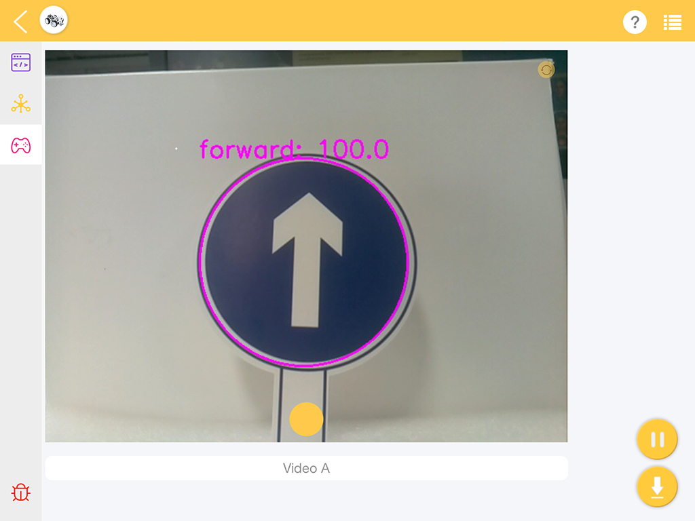
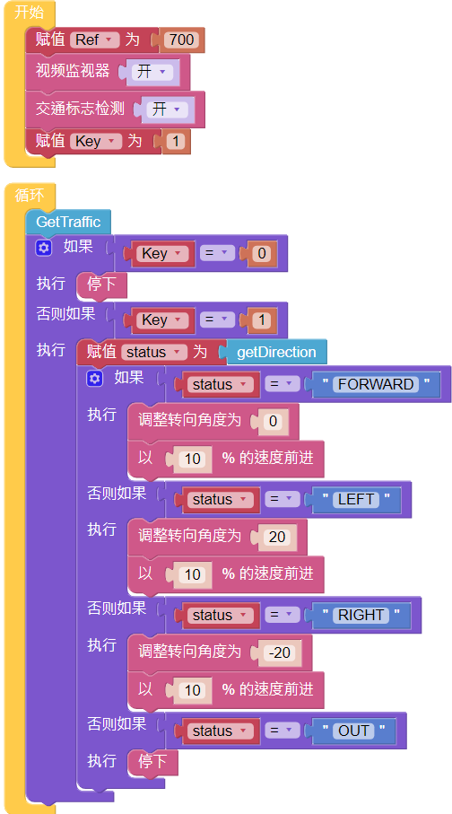

Traffic Sign Detection
===============================

This project uses an image detection function to look for traffic signs, 
and make the PiCar-X follow the instructions on the sign. 
The turn **traffic sign detection [on]** block will recognize 4 different traffic sign models included in the printable PDF below. 
When the PiCar-X detects a **STOP** sign, it will come to a stop, 
a **FORWARD** sign will make it drive forward, and the **LEFT** or **RIGHT** arrows will make it turn that direction. 

* :download:`[PDF]Traffic Sign Cards <https://github.com/sunfounder/sf-pdf/raw/master/prop_card/object_detection/traffic-sign-cards.pdf>`

.. image:: img/block/taffics_sign.png

.. note::

    The printed traffic sign colors may have a slightly different hue from the Ezblock color models due to printer toner differences, or the printed medium, such as a tan-colored paper. This can cause a less accurate color recognition.

This project is based on :ref:`Minecart` , but instead of using the grayscale sensor, the PiCar-X uses an algorithm for traffic sign detection. The detection results can be viewed via the Video Monitor in Ezblock Studio.

**TIPS**

.. image:: img/block/sp210513_110948.png

.. image:: img/block/sp210512_171425.png

.. image:: img/block/sp210512_171454.png