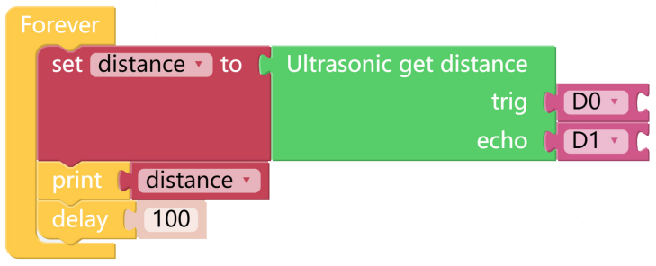

Test Ultrasonic Module
==============================

PiCar-X has a built-in Ultrasonic Sensor module that can be used for obstacle avoidance and automatic object-following experiments. In this lesson the module will read a distance in centimeters (24 cm = 1 inch), and **Print** the results in a **Debug** window.

**TIPS**

.. image:: img/block/sp210512_114549.png 

The **Ultrasonic get distance** block will read the distance from the PiCar-X to an obstacle directly ahead.

.. image:: img/block/sp210512_114830.png

This program is simplified with a **Variable**. For example, when there are multiple functions in a program that each need to use the distance to an obstacle, a **Variable** can be used to report the same distance value to each function, instead of each function reading the same value separately.

Click the **Create variable...** button on the **Variables** category, and use the drop-down arrow to select the variable named “distance”.

.. image:: img/block/sp210512_114945.png

The **Print** function can print data such as variables and text for easy debugging.

.. image:: img/block/debug_monitor.png

Once the code is running, enable the debug monitor by clicking the **Debug** icon in the bottom left corner.

**EXAMPLE**

