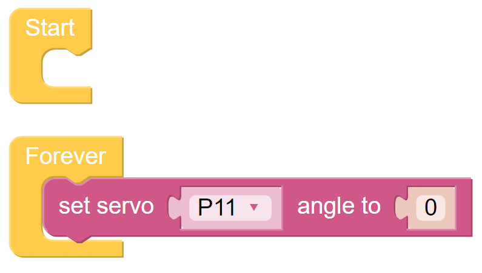
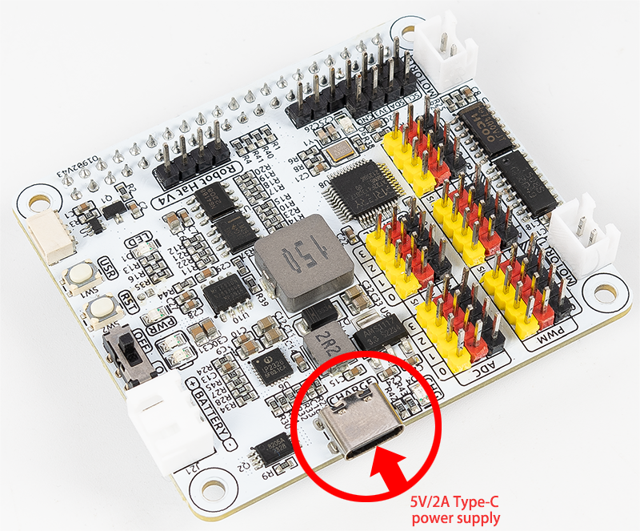

.. note::

    Hello, welcome to the SunFounder Raspberry Pi & Arduino & ESP32 Enthusiasts Community on Facebook! Dive deeper into Raspberry Pi, Arduino, and ESP32 with fellow enthusiasts.

    **Why Join?**

    - **Expert Support**: Solve post-sale issues and technical challenges with help from our community and team.
    - **Learn & Share**: Exchange tips and tutorials to enhance your skills.
    - **Exclusive Previews**: Get early access to new product announcements and sneak peeks.
    - **Special Discounts**: Enjoy exclusive discounts on our newest products.
    - **Festive Promotions and Giveaways**: Take part in giveaways and holiday promotions.

    👉 Ready to explore and create with us? Click [|link_sf_facebook|] and join today!

FAQ
===========================

Q1: After installing Ezblock OS, the servo can't turn to 0°?
-------------------------------------------------------------------

1) Check if the servo cable is properly connected and if the Robot HAT power is on.
2) Press Reset button.
3) If you have already run the program in Ezblock Studio, the custom program for P11 is no longer available. You can refer to the picture below to manually write a program in Ezblock Studio to set the servo angle to 0.

Q2: When using VNC, I am prompted that the desktop cannot be displayed at the moment?
--------------------------------------------------------------------------------------------

In Terminal, type ``sudo raspi-config`` to change the resolution.

Q3: Why does the servo sometimes return to the middle position for no reason?
------------------------------------------------------------------------------------

When the servo is blocked by a structure or other object and cannot reach its intended position, the servo will enter the power-off protection mode in order to prevent the servo from being burned out by too much current.

After a period of power failure, if no PWM signal is given to the servo, the servo will automatically return to its original position.

Q4: About the Robot HAT Detailed Tutorial?
-----------------------------------------------------

You can find a comprehensive tutorial about the Robot HAT here, including information on its hardware and API.

* |link_robot_hat|

Q5: About the Battery Charger?
-----------------------------------------------------

To charge the battery, simply connect a 5V/2A Type-C power supply to the Robot Hat's power port. There's no need to turn on the Robot Hat's power switch during charging.
You can also use the device while charging the battery. 

During charging, the input power is boosted by the charging chip to charge the battery and simultaneously supply the DC-DC converter for external use, with a charging power of approximately 10W. 
If external power consumption remains high for an extended period, the battery may supplement the power supply, similar to using a phone while charging. However, be mindful of the battery's capacity to avoid completely depleting it during simultaneous charging and usage.

Q6: Camera Not Working?
-----------------------------------------------------

If the camera is not displaying or displaying incorrectly, follow these troubleshooting steps:

#. Ensure the FPC cable of the camera is securely connected. It is recommended to reconnect the camera and then power on the device.

.. raw:: html

       

           <video center loop autoplay muted style="max-width:90%">
               <source src="_static/video/rpi_connect1.mp4" type="video/mp4">
               Your browser does not support the video tag.
           </video>
       

2. Use the following command to check if the camera is recognized.

.. code-block::

    libcamera-hello

Q7: ``ERROR: No matching distribution found for piper-tts==1.3.0`` during installation?
----------------------------------------------------------------------------------------------------

This error occurs because you are using a **32-bit** operating system, while ``piper-tts==1.3.0`` only provides pre-built wheels for **64-bit** systems.

**Solution**: Please install a **64-bit** version of Raspberry Pi OS (or your respective operating system) and try the installation again.