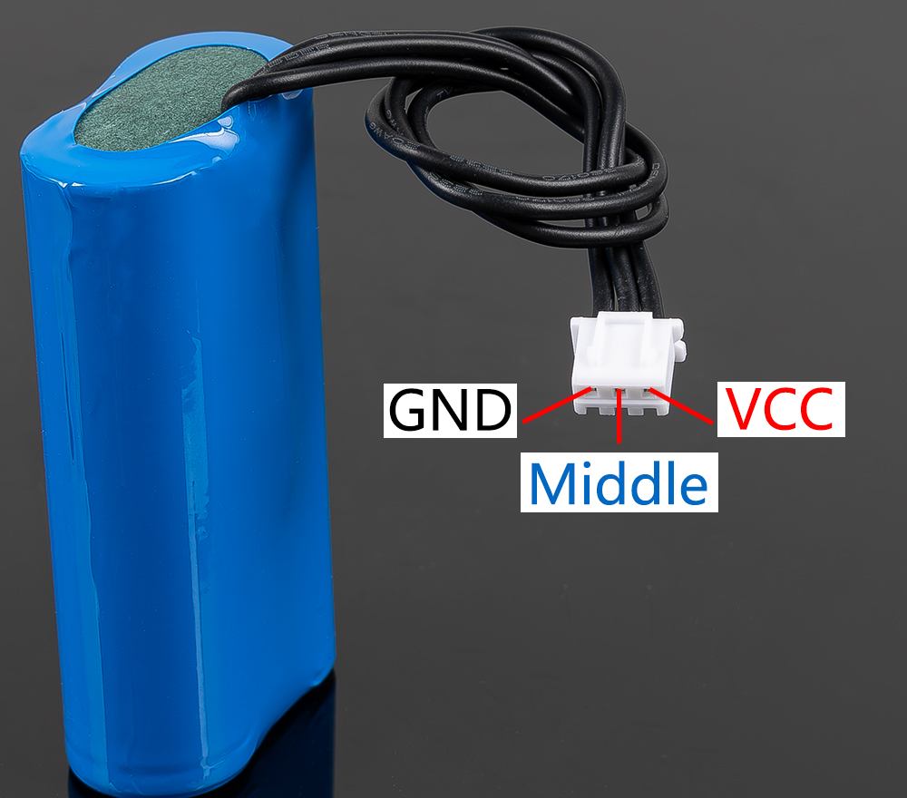

.. note::

    Bonjour et bienvenue dans la communauté Facebook des passionnés de Raspberry Pi, Arduino et ESP32 de SunFounder ! Plongez-vous dans l'univers du Raspberry Pi, Arduino et ESP32 avec d'autres passionnés.

    **Pourquoi nous rejoindre ?**

    - **Support d'experts** : Résolvez vos problèmes après-vente et relevez les défis techniques grâce à l'aide de notre communauté et de notre équipe.
    - **Apprenez & Partagez** : Échangez des astuces et des tutoriels pour améliorer vos compétences.
    - **Aperçus exclusifs** : Bénéficiez d'un accès anticipé aux annonces de nouveaux produits et à des avant-premières.
    - **Remises spéciales** : Profitez de réductions exclusives sur nos derniers produits.
    - **Promotions festives et concours** : Participez à des tirages au sort et à des promotions durant les fêtes.

    👉 Prêt à explorer et à créer avec nous ? Cliquez sur [|link_sf_facebook|] et rejoignez-nous dès aujourd'hui !

Batterie à 3 broches
=============================

* **VCC**: Borne positive de la batterie, il y a ici deux ensembles de VCC et GND pour augmenter le courant et réduire la résistance.
* **Milieu**: Pour équilibrer la tension entre les deux cellules et ainsi protéger la batterie.
* **GND**: Borne négative de la batterie.

Il s'agit d'un pack batterie personnalisé fabriqué par SunFounder composé de deux batteries 18650 d'une capacité de 2000mAh. Le connecteur est XH2.54 3P, qui peut être chargé directement après avoir été inséré dans le Robot HAT.

**Caractéristiques**

* **Composition**: Li-ion
* **Capacité de la batterie**: 2000mAh, 14,8Wh
* **Poids de la batterie**: 90,8g
* **Nombre de cellules**: 2
* **Connecteur**: XH2.54 3P
* **Protection contre la décharge excessive**: 6,0V
