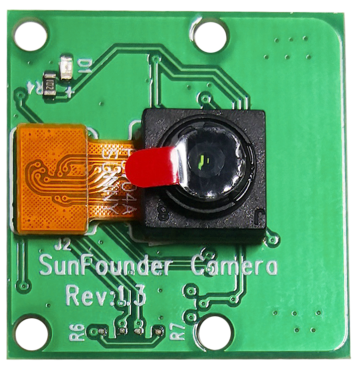

.. note::

    Hello, welcome to the SunFounder Raspberry Pi & Arduino & ESP32 Enthusiasts Community on Facebook! Dive deeper into Raspberry Pi, Arduino, and ESP32 with fellow enthusiasts.

    **Why Join?**

    - **Expert Support**: Solve post-sale issues and technical challenges with help from our community and team.
    - **Learn & Share**: Exchange tips and tutorials to enhance your skills.
    - **Exclusive Previews**: Get early access to new product announcements and sneak peeks.
    - **Special Discounts**: Enjoy exclusive discounts on our newest products.
    - **Festive Promotions and Giveaways**: Take part in giveaways and holiday promotions.

    👉 Ready to explore and create with us? Click [|link_sf_facebook|] and join today!

Camera Module
====================================

**Description**

This is a 5MP Raspberry Pi camera module with OV5647 sensor. It's plug and play, connect the included ribbon cable to the CSI (Camera Serial Interface) port on your Raspberry Pi and you're ready to go.

The board is small, about 25mm x 23mm x 9mm, and weighs 3g, making it ideal for mobile or other size and weight-critical applications. The camera module has a native resolution of 5 megapixels and has an on-board fixed focus lens that captures still images at 2592 x 1944 pixels, and also supports 1080p30, 720p60 and 640x480p90 video.

.. note:: 

   The module is only capable of capturing pictures and videos, not sound.

**Specification**

* **Static Images Resolution**: 2592×1944 
* **Supported Video Resolution**: 1080p/30 fps, 720p/ 60fps and 640 x480p 60/90 video recording 
* **Aperture (F)**: 1.8 
* **Visual Angle**: 65 degree 
* **Dimension**: 24mmx23.5mmx8mm 
* **Weight**: 3g 
* **Interface**: CSI connector 
* **Supported OS**: Raspberry Pi OS(latest version recommended) 

**Assemble the Camera Module**

On the camera module or Raspberry Pi, you will find a flat plastic connector. Carefully pull out the black fixing switch until the fixing switch is partially pulled out. Insert the FFC cable into the plastic connector in the direction shown and push the fixing switch back into place.

If the FFC wire is installed correctly, it will be straight and will not pull out when you gently pull on it. If not, reinstall it again.

.. image:: img/connect_ffc.png
.. image:: img/1.10_camera.png
   :width: 700

.. warning::

   Do not install the camera with the power on, it may damage your camera.

.. **Enable the Camera Interface**

.. Run the following command to enable the camera interface of your Raspberry Pi. If you have enabled it, skip this; if you do not know whether you have done that or not, please continue.

.. .. raw:: html

..    <run></run>

.. .. code-block:: 

..    sudo raspi-config

.. **3 Interfacing options**

.. .. image:: img/image282.png
..    :align: center

.. **P1 Camera**

.. .. image:: img/camera_config1.png
..    :align: center

.. **<Yes>, then <Ok> -> <Finish>**

.. .. image:: img/camera_config2.png
..    :align: center

.. After the configuration is complete, it is recommended to reboot the Raspberry Pi.

.. .. raw:: html

..    <run></run>

.. .. code-block:: 

..    sudo reboot