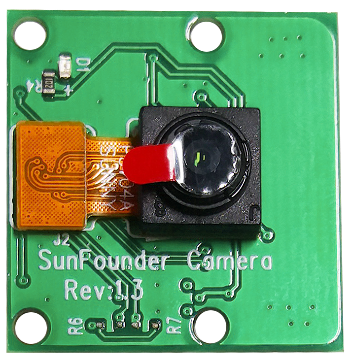
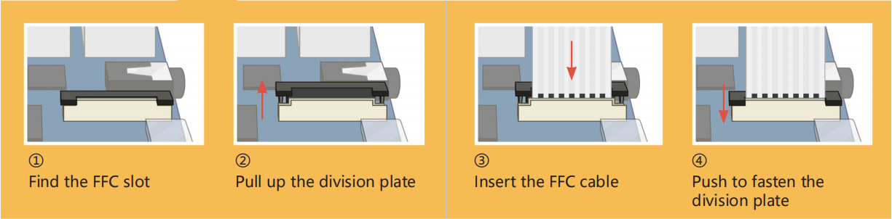
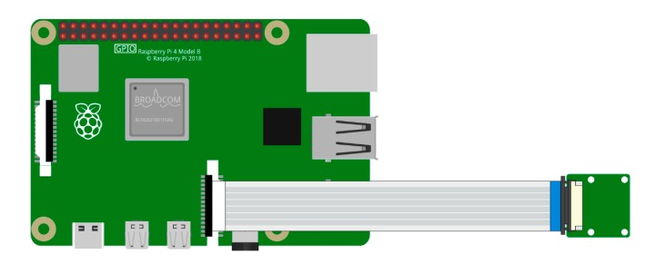

.. note::

    Hallo und willkommen in der SunFounder Raspberry Pi & Arduino & ESP32 Enthusiasten-Gemeinschaft auf Facebook! Tauchen Sie tiefer ein in die Welt von Raspberry Pi, Arduino und ESP32 mit anderen Enthusiasten.

    **Warum beitreten?**

    - **Expertenunterstützung**: Lösen Sie Nachverkaufsprobleme und technische Herausforderungen mit Hilfe unserer Gemeinschaft und unseres Teams.
    - **Lernen & Teilen**: Tauschen Sie Tipps und Anleitungen aus, um Ihre Fähigkeiten zu verbessern.
    - **Exklusive Vorschauen**: Erhalten Sie frühzeitigen Zugang zu neuen Produktankündigungen und exklusiven Einblicken.
    - **Spezialrabatte**: Genießen Sie exklusive Rabatte auf unsere neuesten Produkte.
    - **Festliche Aktionen und Gewinnspiele**: Nehmen Sie an Gewinnspielen und Feiertagsaktionen teil.

    👉 Sind Sie bereit, mit uns zu erkunden und zu erschaffen? Klicken Sie auf [|link_sf_facebook|] und treten Sie heute bei!

Kameramodul
===========

**Beschreibung**

Dies ist ein 5MP Raspberry Pi Kameramodul mit OV5647-Sensor. Es ist Plug-and-Play, verbinden Sie das beiliegende Flachbandkabel mit dem CSI (Camera Serial Interface) Anschluss an Ihrem Raspberry Pi und es ist einsatzbereit.

Die Platine ist klein, etwa 25mm x 23mm x 9mm groß und wiegt 3g, was sie ideal für mobile oder andere größen- und gewichtskritische Anwendungen macht. Das Kameramodul hat eine native Auflösung von 5 Megapixeln und verfügt über ein eingebautes Fixfokus-Objektiv, das Standbilder mit 2592 x 1944 Pixeln aufnimmt und auch 1080p30, 720p60 und 640x480p90 Video unterstützt.

.. note::

   Das Modul kann nur Bilder und Videos aufnehmen, jedoch keinen Ton.

**Spezifikation**

* **Statische Bildauflösung**: 2592×1944
* **Unterstützte Videoauflösung**: 1080p/30 fps, 720p/ 60fps und 640 x 480p 60/90 Videoaufnahme
* **Blende (F)**: 1.8
* **Sichtwinkel**: 65 Grad
* **Abmessungen**: 24mmx23.5mmx8mm
* **Gewicht**: 3g
* **Schnittstelle**: CSI-Anschluss
* **Unterstütztes Betriebssystem**: Raspberry Pi OS (neueste Version empfohlen)

**Kameramodul montieren**

Am Kameramodul oder Raspberry Pi finden Sie einen flachen Kunststoffstecker. Ziehen Sie vorsichtig den schwarzen Befestigungsschalter heraus, bis er teilweise gelöst ist. Führen Sie das FFC-Kabel in die Plastikbuchse in der gezeigten Richtung ein und schieben Sie den Befestigungsschalter wieder in Position.

Wenn das FFC-Kabel korrekt installiert ist, wird es gerade sein und sich nicht herausziehen lassen, wenn Sie vorsichtig daran ziehen. Falls nicht, installieren Sie es erneut.

.. warning::

   Installieren Sie die Kamera nicht bei eingeschaltetem Strom, da dies die Kamera beschädigen kann.

.. **Enable the Camera Interface**

.. Run the following command to enable the camera interface of your Raspberry Pi. If you have enabled it, skip this; if you do not know whether you have done that or not, please continue.

.. .. raw:: html

..    <run></run>

.. .. code-block::

..    sudo raspi-config

.. **3 Interfacing options**

.. .. image:: img/image282.png
..    :align: center

.. **P1 Camera**

.. .. image:: img/camera_config1.png
..    :align: center

.. **<Yes>, then <Ok> -> <Finish>**

.. .. image:: img/camera_config2.png
..    :align: center

.. After the configuration is complete, it is recommended to reboot the Raspberry Pi.

.. .. raw:: html

..    <run></run>

.. .. code-block::

..    sudo reboot
