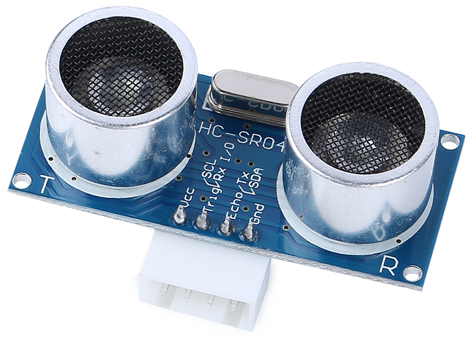

.. note::

    Bonjour et bienvenue dans la communauté Facebook des passionnés de Raspberry Pi, Arduino et ESP32 de SunFounder ! Plongez-vous dans l'univers du Raspberry Pi, Arduino et ESP32 avec d'autres passionnés.

    **Pourquoi nous rejoindre ?**

    - **Support d'experts** : Résolvez vos problèmes après-vente et relevez les défis techniques grâce à l'aide de notre communauté et de notre équipe.
    - **Apprenez & Partagez** : Échangez des astuces et des tutoriels pour améliorer vos compétences.
    - **Aperçus exclusifs** : Bénéficiez d'un accès anticipé aux annonces de nouveaux produits et à des avant-premières.
    - **Remises spéciales** : Profitez de réductions exclusives sur nos derniers produits.
    - **Promotions festives et concours** : Participez à des tirages au sort et à des promotions durant les fêtes.

    👉 Prêt à explorer et à créer avec nous ? Cliquez sur [|link_sf_facebook|] et rejoignez-nous dès aujourd'hui !

Module Ultrasonique
================================

* **TRIG**: Entrée d'impulsion de déclenchement
* **ECHO**: Sortie d'impulsion d'écho
* **GND**: Masse
* **VCC**: Alimentation 5V

Voici le capteur de distance ultrasonique HC-SR04, offrant une mesure sans contact de 2 cm à 400 cm avec une précision de portée allant jusqu'à 3 mm. Le module comprend un émetteur ultrasonique, un récepteur et un circuit de commande.

Vous n'avez besoin de connecter que 4 broches : VCC (alimentation), Trig (déclenchement), Echo (réception) et GND (masse) pour le rendre facile à utiliser dans vos projets de mesure.

**Caractéristiques**

* Tension de fonctionnement : DC5V
* Courant de fonctionnement : 16mA
* Fréquence de travail : 40Hz
* Portée maximale : 500cm
* Portée minimale : 2cm
* Signal d'entrée de déclenchement : impulsion TTL de 10uS
* Signal de sortie d'écho : signal de niveau TTL d'entrée et portée proportionnelle
* Connecteur : XH2.54-4P
* Dimensions : 46x20.5x15 mm

**Principe**

Les principes de base sont les suivants :

* Utiliser le déclencheur IO pour un signal de niveau haut d'au moins 10us.
* Le module envoie une rafale de 8 cycles d'ultrasons à 40 kHz et détecte si un signal d'impulsion est reçu.
* L'écho produira un niveau haut si un signal est renvoyé ; la durée du niveau haut est le temps entre l'émission et le retour.
* Distance = (temps de niveau haut x vitesse du son (340M/S)) / 2

    .. image:: img/ultrasonic_prin.jpg
        :width: 800

Formule :

* us / 58 = distance en centimètres
* us / 148 = distance en pouces
* distance = temps de niveau haut x vitesse (340M/S) / 2

**Notes d'Application**

* Ce module ne doit pas être connecté sous tension ; si nécessaire, connectez d'abord le GND du module. Sinon, cela affectera le fonctionnement du module.
* La surface de l'objet à mesurer doit être d'au moins 0,5 mètre carré et aussi plate que possible. Sinon, les résultats seront affectés.