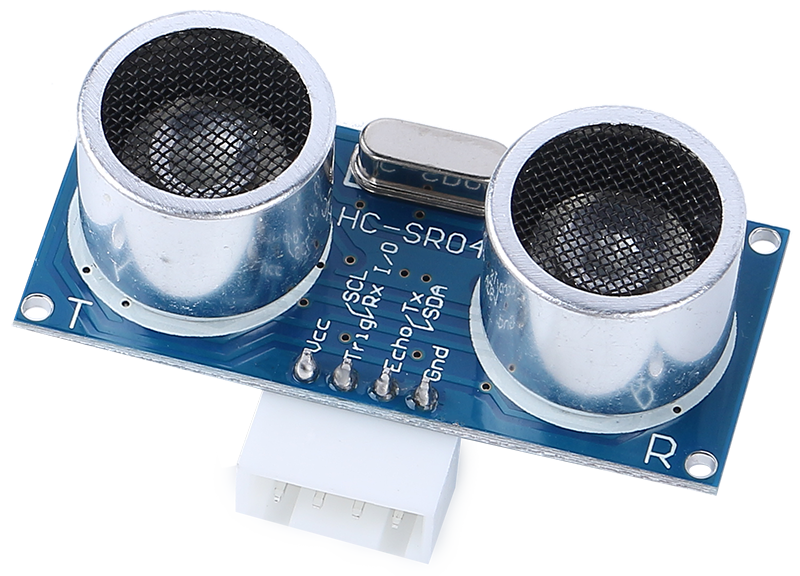

.. note::

    ¡Hola! Bienvenido a la comunidad de entusiastas de SunFounder Raspberry Pi, Arduino y ESP32 en Facebook. ¡Profundiza en el mundo de Raspberry Pi, Arduino y ESP32 junto a otros entusiastas!

    **¿Por qué unirte?**

    - **Soporte experto**: Resuelve problemas postventa y desafíos técnicos con la ayuda de nuestra comunidad y equipo.
    - **Aprende y comparte**: Intercambia consejos y tutoriales para mejorar tus habilidades.
    - **Preestrenos exclusivos**: Obtén acceso anticipado a nuevos anuncios de productos y adelantos.
    - **Descuentos especiales**: Disfruta de descuentos exclusivos en nuestros productos más recientes.
    - **Promociones festivas y sorteos**: Participa en sorteos y promociones especiales.

    👉 ¿Listo para explorar y crear con nosotros? Haz clic en [|link_sf_facebook|] y únete hoy mismo.

Módulo Ultrasónico
==================

* **TRIG**: Entrada de pulso de disparo
* **ECHO**: Salida de pulso de eco
* **GND**: Tierra
* **VCC**: Alimentación de 5V

Este es el sensor de distancia ultrasónico HC-SR04, que proporciona medición sin contacto desde 2 cm hasta 400 cm con una precisión de rango de hasta 3 mm. El módulo incluye un transmisor ultrasónico, un receptor y un circuito de control.

Solo necesitas conectar 4 pines: VCC (alimentación), Trig (disparo), Echo (recepción) y GND (tierra) para hacerlo fácil de usar en tus proyectos de medición.

**Características**

* Voltaje de funcionamiento: DC5V
* Corriente de funcionamiento: 16mA
* Frecuencia de trabajo: 40Hz
* Alcance máximo: 500cm
* Alcance mínimo: 2cm
* Señal de entrada de disparo: pulso TTL de 10uS
* Señal de salida de eco: señal de nivel TTL de entrada y rango proporcional
* Conector: XH2.54-4P
* Dimensiones: 46x20.5x15 mm

**Principio**

Los principios básicos son los siguientes:

* Usar el disparo IO para una señal alta de al menos 10us.
* El módulo envía una ráfaga de 8 ciclos de ultrasonido a 40 kHz y detecta si se recibe una señal de pulso.
* El eco emitirá un nivel alto si se devuelve una señal; la duración del nivel alto es el tiempo desde la emisión hasta el retorno.
* Distancia = (tiempo de nivel alto x velocidad del sonido (340M/S)) / 2

    .. image:: img/ultrasonic_prin.jpg
        :width: 800

Fórmula:

* us / 58 = distancia en centímetros
* us / 148 = distancia en pulgadas
* distancia = tiempo de nivel alto x velocidad (340M/S) / 2

**Notas de Aplicación**

* Este módulo no debe conectarse bajo tensión; si es necesario, primero conecte el GND del módulo. De lo contrario, afectará el funcionamiento del módulo.
* El área del objeto a medir debe ser de al menos 0,5 metros cuadrados y lo más plana posible. De lo contrario, los resultados se verán afectados.