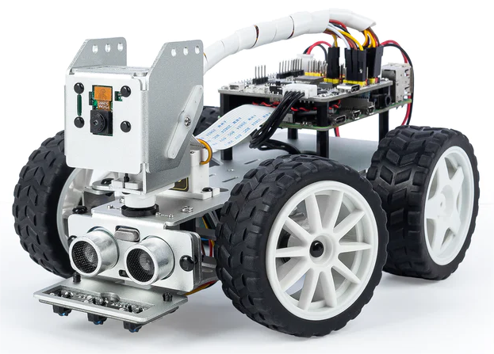

SunFounder PiCar-X Kit
============================================

Danke, dass Sie sich für unser PiCar-X entschieden haben.

.. note::
    Dieses Dokument ist in den folgenden Sprachen verfügbar.

        * |link_german_tutorials|
        * |link_jp_tutorials|
        * |link_en_tutorials|
    
    Bitte klicken Sie auf die jeweiligen Links, um das Dokument in Ihrer bevorzugten Sprache aufzurufen.

Das PiCar-X ist ein von KI angetriebenes autonomes Roboter-Auto für die Raspberry Pi-Plattform, bei dem der Raspberry Pi als Steuerzentrale fungiert. 
Das 2-Achsen-Kamera-Modul, das Ultraschall-Modul und die Linienverfolgungs-Module des PiCar-X ermöglichen Funktionen wie Farb-/Gesichts-/Verkehrsschilder-Erkennung, 
automatische Hindernisvermeidung und automatische Linienverfolgung.

Das PiCar-X unterstützt zwei Programmiersprachen: Blockly und Python. Unabhängig davon, in welcher Sprache Sie programmieren, finden Sie detaillierte Schritte, die Ihnen alles von der Konfiguration des Raspberry Pi bis zum Ausführen des relevanten Beispielcodes beibringen.

* :ref:`play_python`

    * Dieses Kapitel richtet sich an diejenigen, die gerne in Python programmieren oder die Python-Sprache erlernen möchten.
    * Um das PiCar-X ordnungsgemäß zu betreiben, müssen Sie zuerst einige Bibliotheken installieren.
    * In diesem Kapitel werden die Raspberry Pi-Konfiguration und Beispielcodes für das PiCar-X bereitgestellt.
    * Eine APP - SunFounder Controller wird ebenfalls bereitgestellt, damit Sie das PiCar-X über Ihr mobiles Gerät fernsteuern können.

* :ref:`play_ezblock`

    * In diesem Abschnitt verwenden Sie die auf Blockly basierende APP Ezblock Studio, die es Ihnen ähnlich wie Scratch ermöglicht, Bausteine zu ziehen und abzulegen, um das PiCar-X zu bewegen.
    * Es ist notwendig, die SD-Karte mit dem von uns bereitgestellten Betriebssystem neu zu installieren, das bereits mit der Ezblock-Umgebung ausgestattet ist, bevor Sie mit der Programmierung beginnen. Für diesen Abschnitt empfehlen wir die Verwendung einer neuen oder unbenutzten TF-Karte.
    * Ezblock Studio ist für fast alle Gerätetypen verfügbar, einschließlich Macs, PCs und Android-Geräten.
    * Ezblock Studio ist eine gute Wahl, wenn Sie zwischen 6 und 12 Jahre alt sind, keine Programmierkenntnisse haben oder das PiCar-X schnell testen möchten.

**Inhalt**

.. toctree::
    :maxdepth: 3

    Über dieses Kit <self>
    introduction
    list_and_assembly
    adjust_servo
    python/play_with_python
    python_video_course/python_video_course
    ezblock/play_with_ezblock
    appendix/appendix
    faq
    thank

Urheberrechtshinweis
--------------------------

Alle Inhalte dieses Handbuchs, einschließlich aber nicht beschränkt auf Texte, Bilder und Code, sind Eigentum der SunFounder Company. Sie dürfen diese nur für persönliches Studium, Forschung, Freude oder andere nicht-kommerzielle oder gemeinnützige Zwecke verwenden, gemäß den einschlägigen Vorschriften und Urheberrechtsgesetzen, ohne die rechtlichen Rechte des Autors und der betreffenden Rechteinhaber zu verletzen. Für jede Einzelperson oder Organisation, die diese ohne Genehmigung für kommerzielle Gewinne verwendet, behält sich das Unternehmen das Recht vor, rechtliche Schritte einzuleiten.