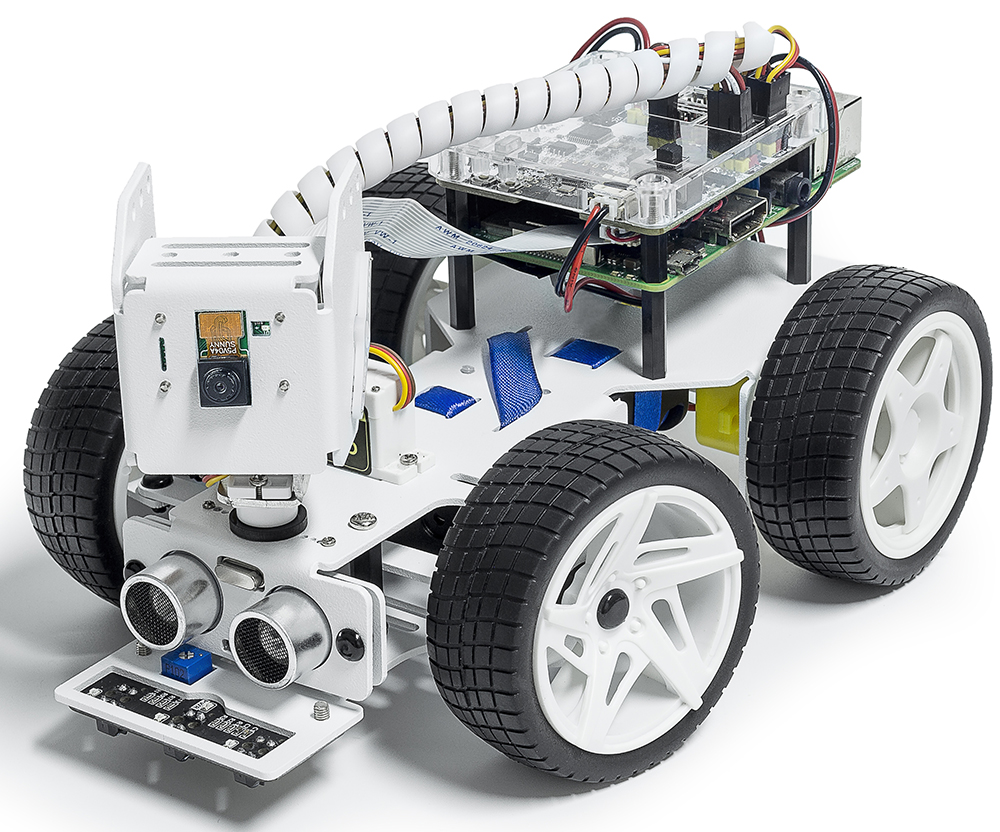

Welcome to PiCar-X's Documentation!
===================================

Thanks for choosing our PiCar-X.

The PiCar-X is an AI-driven self-driving robot car for the Raspberry Pi platform, upon which the Raspberry Pi acts as the control center. 
The PiCar-X’s 2-axis camera module, ultrasonic module, and line tracking modules can provide the functions of color/face/traffic-signs detection, 
automatic obstacle avoidance, automatic line tracking, etc.

PiCar-X has two programming languages: Blockly and Python. No matter what language you program in, you'll find detailed steps to teach you everything from configuring the Raspberry Pi to running the relevant example code.

* :ref:`play_python`

    * This chapter is for those who enjoy programming in Python or want to learn the Python language.
    * To get Picar-X working properly, you must install some libraries first.
    * The Raspberry Pi configuration and samples code for the PiCar-X are provided in this chapter.
    * An APP - SunFounder Controller is also provided to allow you to remotely control the PiCar-X on your mobile device.

* :ref:`play_ezblock`

    * In this section, you will use a Blockly based APP, Ezblock Studio, which, like Scratch, allows you to drag and drop blocks to make Picar-X move.
    * It is required to reinstall the SD card with the operating system we provide with pre-installed Ezblock environment before programming. It is recommended to use a new or unused TF card for this section.
    * Ezblock Studio is available for nearly all types of devices, including Macs, PCs, and Androids.
    * Ezblock Studio is a good choice if you are 6-12 years old, or don't have programming skills, or want to test Picar-X quickly.

**About the display language**

In addition to English, we are working on other languages for this course. Please contact service@sunfounder.com if you are interested in helping, and we will give you a free product in return. 
In the meantime, we recommend using Google Translate to convert English to the language you want to see.

The steps are as follows.

* In this course page, right-click and select **Translate to xx**. If the current language is not what you want, you can change it later.

.. image:: img/translate1.png
    :align: center

* There will be a language popup in the upper right corner. Click on the menu button to **choose another language**.

.. image:: img/translate2.png
    :align: center

* Select the language from the inverted triangle box, and then click **Done**.

.. image:: img/translate3.png
    :align: center

**Content**

.. toctree::
    :maxdepth: 3

    introduction
    list_and_assembly
    adjust_servo
    python/play_with_python
    ezblock/play_with_ezblock
    appendix/appendix
    faq
    thank
    jp_online_tutorial

Copyright Notice
--------------------------

All contents including but not limited to texts, images, and code in this manual are owned by the SunFounder Company. You should only use it for personal study,investigation, enjoyment, or other non-commercial or nonprofit purposes, under therelated regulations and copyrights laws, without infringing the legal rights of the author and relevant right holders. For any individual or organization that uses these for commercial profit without permission, the Company reserves the right to take legal action.

