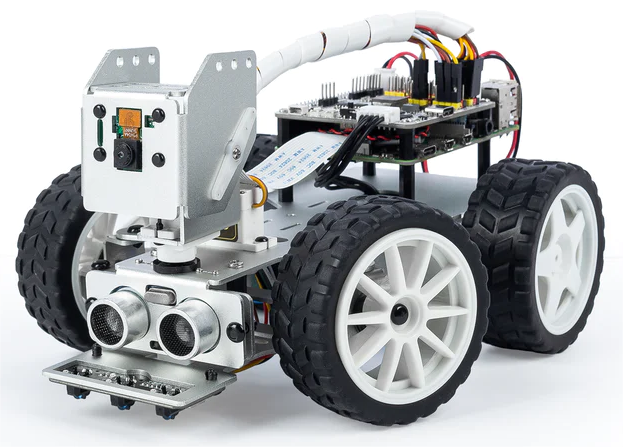

.. note::

    Bonjour, bienvenue dans la communauté des passionnés de Raspberry Pi, Arduino et ESP32 de SunFounder sur Facebook ! Plongez dans l'univers de Raspberry Pi, Arduino et ESP32 avec d'autres passionnés.

    **Pourquoi nous rejoindre ?**

    - **Support d'experts** : Résolvez des problèmes après-vente et des défis techniques grâce à l'aide de notre communauté et de notre équipe.
    - **Apprendre et partager** : Échangez des astuces et des tutoriels pour améliorer vos compétences.
    - **Aperçus exclusifs** : Obtenez un accès anticipé aux annonces de nouveaux produits et aux avant-premières.
    - **Réductions exclusives** : Profitez de réductions spéciales sur nos derniers produits.
    - **Promotions et cadeaux festifs** : Participez à des concours et promotions festifs.

    👉 Prêt à explorer et à créer avec nous ? Cliquez sur [|link_sf_facebook|] et rejoignez-nous dès aujourd'hui !

SunFounder |link_PiCar_kit|
============================================

* |link_PiCar-X_kit|

Merci d'avoir choisi notre |link_PiCar_kit|.

.. note::
    Ce document est disponible dans les langues suivantes :

        * |link_german_tutorials|
        * |link_jp_tutorials|
        * |link_en_tutorials|
        * |link_fr_tutorials|
        * |link_es_tutorials|
        * |link_it_tutorials|
        * |link_cn_tutorials|

    Cliquez sur les liens respectifs pour accéder au document dans la langue de votre choix.

Le PiCar-X est une voiture robot autonome, pilotée par IA, conçue pour la 
plateforme Raspberry Pi, où le Raspberry Pi joue le rôle de centre de contrôle. 
Le module caméra à deux axes, le module ultrason et les modules de suivi de ligne 
du PiCar-X offrent des fonctions telles que la détection de couleurs, de visages 
et de panneaux de signalisation, l'évitement automatique des obstacles et le suivi 
automatique de ligne.

Le PiCar-X peut être programmé dans deux langages : Blockly et Python. Quel que soit le langage utilisé, vous trouverez des étapes détaillées pour configurer le Raspberry Pi et exécuter les exemples de code associés.

* :ref:`play_python`

    * Ce chapitre est destiné à ceux qui aiment programmer en Python ou souhaitent apprendre ce langage.
    * Pour faire fonctionner correctement le PiCar-X, il est nécessaire d'installer certaines bibliothèques.
    * La configuration du Raspberry Pi et les exemples de code pour le PiCar-X sont fournis dans ce chapitre.
    * Une application - SunFounder Controller est également disponible pour vous permettre de contrôler à distance le PiCar-X sur votre appareil mobile.

* :ref:`play_ezblock`

    * Dans cette section, vous utiliserez une application basée sur Blockly, Ezblock Studio, qui vous permet de déplacer le PiCar-X en glissant-déposant des blocs, comme dans Scratch.
    * Il est nécessaire de réinstaller la carte SD avec le système d'exploitation que nous fournissons, avec l'environnement Ezblock préinstallé, avant de commencer à programmer. Il est recommandé d'utiliser une carte TF neuve ou inutilisée pour cette section.
    * Ezblock Studio est disponible pour presque tous les types d'appareils, y compris Mac, PC et Android.
    * Ezblock Studio est un bon choix si vous avez entre 6 et 12 ans, si vous n'avez pas de compétences en programmation ou si vous souhaitez tester rapidement le PiCar-X.

**Sommaire**

.. toctree::
    :maxdepth: 3

    About This Kit <self>
    assemble
    python/play_with_python
    ai_interaction/ai_interaction
    python_video_course/python_video_course
    ezblock/play_with_ezblock
    adjust_servo
    appendix
    hardware/cpn_hardware
    faq

Avis de droits d'auteur
----------------------------

Tous les contenus, y compris mais sans s'y limiter, les textes, les images et le code de ce manuel, sont la propriété de SunFounder. Vous ne devez les utiliser qu'à des fins d'étude personnelle, de recherche, de divertissement ou à d'autres fins non commerciales ou à but non lucratif, conformément aux réglementations et lois sur les droits d'auteur, sans enfreindre les droits légaux de l'auteur et des titulaires de droits concernés. Pour toute personne ou organisation qui utilise ces contenus à des fins lucratives sans autorisation, la société se réserve le droit d'engager des poursuites judiciaires.

