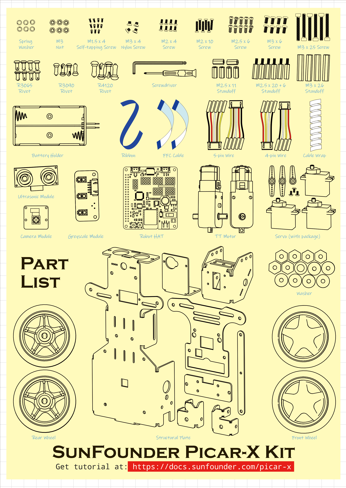

List
====================

About Robot HAT
-----------------------------

.. image:: img/picar_x_pic7.png

**RST Button**
    * Short pressing RST Button causes program resetting.
    * Long press RST Button till the LED lights up then release, and you will disconnect the Bluetooth.

**USR Button**
    * The functions of USR Button can be set by your programming. (Pressing down leads to a input “0”; releasing produces a input “1”. ) 

**LED**
    * Set by your program. (Outputting 1 turns the LED on; Outputting 0 turns it off.)

**Battery Indicator**
    * The voltage ranging above 7.8V, two LEDs light up; ranging 6.7V~7.8V, one LED turns on; ranging below 6.7V, all LEDs turn off.

**Bluetooth Indicator**
    * The Bluetooth indicator keeps turning on at a well Bluetooth connection, blink at a Bluetooth disconnection, blink fast at a signal transmission.    