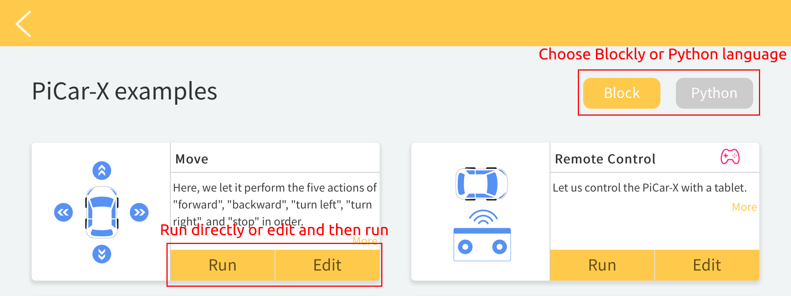

Projects
=========================

Here, we show you the projects of playing PiCar-X on Ezblock Studio. If you are new to these, 
you can try to write the corresponding function according to TIPS, or directly 
use the reference code in Example. We suggest you do it yourself and experience the 
fun of challenges.

If you don't want to write these projects one by one, we have uploaded them to Ezblock Studio's Examples page and you can run them directly or edit them and run them later.

Also on the Examples page you can choose Block or Python language, but in the projects below, only the Block language is explained.

You can use this `file <https://github.com/sunfounder/picar-x/blob/v2.0/docs/(EN)%20picarmini.mdthe>`_ to help you understand the Python code.

**Basic**

.. toctree::

    ezblock_move
    ezblock_remote_control
    ezblock_ultrasonic
    ezblock_grayscale
    ezblock_color_detection
    ezblock_face_detection
    ezblock_sound_effect
    ezblock_background_music

**Advanced**

.. toctree::

    ezblock_say_hello
    ezblock_music_car
    ezblock_cliff_detection
    ezblock_minecart
    ezblock_minecart_plus
    ezblock_bullfight
    ezblock_beware_pedestrians
    ezblock_traffic
    ezblock_orienteering