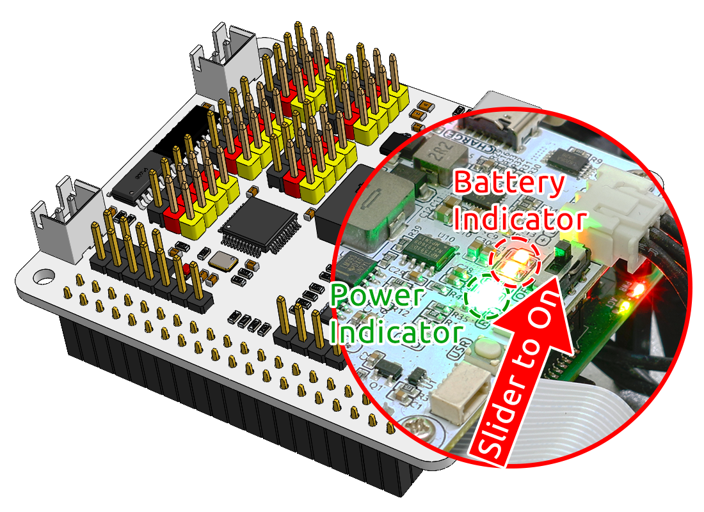

.. note::

    こんにちは、SunFounderのRaspberry Pi & Arduino & ESP32愛好家コミュニティへようこそ！Facebook上でRaspberry Pi、Arduino、ESP32についてもっと深く掘り下げ、他の愛好家と交流しましょう。

    **参加する理由は？**

    - **エキスパートサポート**：コミュニティやチームの助けを借りて、販売後の問題や技術的な課題を解決します。
    - **学び＆共有**：ヒントやチュートリアルを交換してスキルを向上させましょう。
    - **独占的なプレビュー**：新製品の発表や先行プレビューに早期アクセスしましょう。
    - **特別割引**：最新製品の独占割引をお楽しみください。
    - **祭りのプロモーションとギフト**：ギフトや祝日のプロモーションに参加しましょう。

    👉 私たちと一緒に探索し、創造する準備はできていますか？[|link_sf_facebook|]をクリックして今すぐ参加しましょう！

起動 & 充電
======================

充電
-------------------

バッテリーケーブルを挿入してください。次に、バッテリーを充電するためにUSB-Cケーブルを挿入します。
充電器はご自身で用意する必要があります。5V 3Aの充電器をお勧めしますが、お使いのスマートフォンの充電器でも問題ありません。

.. image:: img/BTR_IMG_1096.png

.. note::
    ロボットハットのType-Cポートに外部のType-C電源を接続すると、すぐにバッテリーの充電が開始され、赤いインジケーターライトが点灯します。\
    バッテリーが完全に充電されると、赤いライトは自動的に消灯します。

起動
----------------------

電源スイッチをオンにしてください。電源インジケーターライトとバッテリーレベルインジケーターライトが点灯します。

数秒待ってから、軽いビープ音が聞こえるはずです。これはラズベリーパイが正常に起動したことを示しています。

.. note::
    バッテリーレベルインジケーターライトが両方ともオフの場合は、バッテリーを充電してください。
    長時間のプログラミングやデバッグが必要な場合は、USB-Cケーブルを挿入してバッテリーを同時に充電し、ラズベリーパイを稼働させることができます。

18650 バッテリー
-----------------------------------

.. image:: img/3pin_battery.jpg

* VCC: バッテリーの正極端子です。ここにはVCCとGNDの2つのセットがあり、電流を増やし、抵抗を減らすためです。
* Middle: 2つのセル間の電圧を均等にし、バッテリーを保護します。
* GND: バッテリーの負極端子です。

これはSunFounderが製作した2つの18650バッテリーから成るカスタムバッテリーパックで、容量は2000mAhです。コネクタはXH2.54 3Pで、シールドに挿入した後、直接充電できます。

**特徴**

* バッテリー充電：5V/2A
* バッテリー出力：5V/5A
* バッテリー容量：3.7V 2000mAh x 2
* バッテリー寿命：90分
* バッテリー充電時間：130分
* コネクタ：XH2.54 3P
