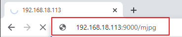

.. note::

    Hello, welcome to the SunFounder Raspberry Pi & Arduino & ESP32 Enthusiasts Community on Facebook! Dive deeper into Raspberry Pi, Arduino, and ESP32 with fellow enthusiasts.

    **Why Join?**

    - **Expert Support**: Solve post-sale issues and technical challenges with help from our community and team.
    - **Learn & Share**: Exchange tips and tutorials to enhance your skills.
    - **Exclusive Previews**: Get early access to new product announcements and sneak peeks.
    - **Special Discounts**: Enjoy exclusive discounts on our newest products.
    - **Festive Promotions and Giveaways**: Take part in giveaways and holiday promotions.

    👉 Ready to explore and create with us? Click [|link_sf_facebook|] and join today!

.. _py_bull_fight:

10. Bull Fight
=============================

Make PiCar-X an angry bull! Use its camera to track and rush the red cloth!

**Run the Code**

.. raw:: html

    <run></run>

.. code-block::

    cd ~/picar-x/example
    sudo python3 10.bull_fight.py

**View the Image**

After the code runs, the terminal will display the following prompt:

.. code-block::

    No desktop !
    * Serving Flask app "vilib.vilib" (lazy loading)
    * Environment: production
    WARNING: Do not use the development server in a production environment.
    Use a production WSGI server instead.
    * Debug mode: off
    * Running on http://0.0.0.0:9000/ (Press CTRL+C to quit)

Then you can enter ``http://<your IP>:9000/mjpg`` in the browser to view the video screen. such as:  ``https://192.168.18.113:9000/mjpg``

**Code**

.. note::
    You can **Modify/Reset/Copy/Run/Stop** the code below. But before that, you need to go to source code path like ``picar-x\examples``. After modifying the code, you can run it directly to see the effect.

.. raw:: html

    <run></run>

.. code-block:: python

    from picarx import Picarx
    from time import sleep
    from vilib import Vilib

    px = Picarx()

    def clamp_number(num,a,b):
    return max(min(num, max(a, b)), min(a, b))

    def main():
        Vilib.camera_start()
        Vilib.display()
        Vilib.color_detect("red")
        speed = 50
        dir_angle=0
        x_angle =0
        y_angle =0
        while True:
            if Vilib.detect_obj_parameter['color_n']!=0:
                coordinate_x = Vilib.detect_obj_parameter['color_x']
                coordinate_y = Vilib.detect_obj_parameter['color_y']
                
                # change the pan-tilt angle for track the object
                x_angle +=(coordinate_x*10/640)-5
                x_angle = clamp_number(x_angle,-35,35)
                px.set_cam_pan_angle(x_angle)

                y_angle -=(coordinate_y*10/480)-5
                y_angle = clamp_number(y_angle,-35,35)
                px.set_cam_tilt_angle(y_angle)

                # move
                # The movement direction will change slower than the pan/tilt direction 
                # change to avoid confusion when the picture changes at high speed.
                if dir_angle > x_angle:
                    dir_angle -= 1
                elif dir_angle < x_angle:
                    dir_angle += 1
                px.set_dir_servo_angle(x_angle)
                px.forward(speed)
                sleep(0.05)

            else :
                px.forward(0)
                sleep(0.05)

    if __name__ == "__main__":
        try:
        main()
        
        finally:
            px.stop()
            print("stop and exit")
            sleep(0.1)

**How it works?**

You need to pay attention to the following three parts of this example:

1. Define the main function:

    * Start the camera using ``Vilib.camera_start()``.
    * Display the camera feed using ``Vilib.display()``.
    * Enable color detection and specify the target color as "red" using ``Vilib.color_detect("red")``.
    * Initialize variables: ``speed`` for car movement speed, ``dir_angle`` for the direction angle of the car's movement, ``x_angle`` for the camera's pan angle, and ``y_angle`` for the camera's tilt angle.

2. Enter a continuous loop (while True) to track the red-colored object:

    * Check if there is a detected red-colored object (``Vilib.detect_obj_parameter['color_n'] != 0``).
    * If a red-colored object is detected, obtain its coordinates (``coordinate_x`` and ``coordinate_y``).
    * Calculate new pan and tilt angles (``x_angle`` and ``y_angle``) based on the detected object's position and adjust them to track the object.
    * Limit the pan and tilt angles within the specified range using the ``clamp_number`` function.
    * Set the camera's pan and tilt angles using ``px.set_cam_pan_angle()`` and ``px.set_cam_tilt_angle()`` to keep the object in view.

3. Control the car's movement based on the difference between dir_angle and ``x_angle``:

    * If ``dir_angle`` is greater than ``x_angle``, decrement ``dir_angle`` by 1 to gradually change the direction angle.
    * If ``dir_angle`` is less than ``x_angle``, increment ``dir_angle`` by 1.
    * Set the direction servo angle using ``px.set_dir_servo_angle()`` to steer the car's wheels accordingly.
    * Move the car forward at the specified speed using ``px.forward(speed)``.