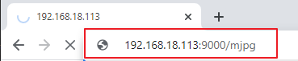

.. note::

    Bonjour et bienvenue dans la communauté des passionnés de SunFounder Raspberry Pi, Arduino et ESP32 sur Facebook ! Plongez au cœur des projets avec Raspberry Pi, Arduino et ESP32 aux côtés d'autres passionnés.

    **Pourquoi nous rejoindre ?**

    - **Support d'experts** : Résolvez les problèmes après-vente et surmontez les défis techniques avec l'aide de notre communauté et de notre équipe.
    - **Apprenez & Partagez** : Échangez des conseils et des tutoriels pour améliorer vos compétences.
    - **Aperçus exclusifs** : Accédez en avant-première aux annonces et aperçus de nouveaux produits.
    - **Réductions spéciales** : Profitez de remises exclusives sur nos produits les plus récents.
    - **Promotions festives et concours** : Participez à des promotions et concours lors d'événements spéciaux.

    👉 Prêt à explorer et à créer avec nous ? Cliquez sur [|link_sf_facebook|] et rejoignez-nous dès aujourd'hui !

.. _py_computer_vision:

7. Vision par Ordinateur
============================

Ce projet vous fera entrer officiellement dans le domaine de la vision par ordinateur !

**Exécuter le Code**

.. raw:: html

    <run></run>

.. code-block::

    cd ~/picar-x/example
    sudo python3 7.computer_vision.py

**Voir l'image**

Après l'exécution du code, le terminal affichera le message suivant :

.. code-block::

    Pas de bureau !
    * Serve Flask app "vilib.vilib" (chargement paresseux)
    * Environnement : production
    AVERTISSEMENT : N'utilisez pas le serveur de développement en production.
    Utilisez un serveur WSGI de production à la place.
    * Mode débogage : désactivé
    * Fonctionne sur http://0.0.0.0:9000/ (Appuyez sur CTRL+C pour quitter)

Ensuite, vous pouvez entrer ``http://<votre IP>:9000/mjpg`` dans le navigateur pour voir l'écran vidéo. Exemple :  ``https://192.168.18.113:9000/mjpg``

Une fois le programme exécuté, vous verrez les informations suivantes dans le terminal :

* Appuyez sur une touche pour appeler la fonction !
* q : Prendre une photo
* 1 : Détection de couleur : rouge
* 2 : Détection de couleur : orange
* 3 : Détection de couleur : jaune
* 4 : Détection de couleur : vert
* 5 : Détection de couleur : bleu
* 6 : Détection de couleur : violet
* 0 : Désactiver la détection de couleur
* r : Scanner le code QR
* f : Activer/désactiver la détection de visage
* s : Afficher les informations sur l'objet détecté

Veuillez suivre les indications pour activer les fonctions correspondantes.

    *  **Prendre une photo**

        Tapez ``q`` dans le terminal et appuyez sur Entrée. L'image actuellement vue par la caméra sera enregistrée (si la fonction de détection de couleur est activée, la boîte de marquage apparaîtra également dans l'image enregistrée). 
        Vous pouvez consulter ces photos dans le répertoire ``/home/{username}/Pictures/`` du Raspberry Pi.
        Vous pouvez utiliser des outils tels que :ref:`filezilla` pour transférer les photos sur votre PC.
        

    *  **Détection de couleur**

        Entrer un nombre entre ``1~6`` permet de détecter l'une des couleurs : "rouge, orange, jaune, vert, bleu, violet". Tapez ``0`` pour désactiver la détection de couleur.

        .. image:: img/DTC2.png

        .. note:: Vous pouvez télécharger et imprimer les :download:`Cartes de couleur PDF <https://github.com/sunfounder/sf-pdf/raw/master/prop_card/object_detection/color-cards.pdf>` pour la détection de couleur.

    *  **Détection de visage**

        Tapez ``f`` pour activer la détection de visage.

        .. image:: img/DTC5.png

    *  **Détection de code QR**

        Tapez ``r`` pour activer la reconnaissance de code QR. Aucune autre opération ne pourra être effectuée tant que le code QR ne sera pas reconnu. Les informations de décodage du code QR seront affichées dans le terminal.

        .. image:: img/DTC4.png

    *  **Afficher les informations**

        Tapez ``s`` pour afficher les informations sur les cibles de détection de visage (et de couleur) dans le terminal, y compris les coordonnées centrales (X, Y) et la taille (largeur, hauteur) de l'objet détecté.

**Code** 

.. code-block:: python

    from pydoc import text
    from vilib import Vilib
    from time import sleep, time, strftime, localtime
    import threading
    import readchar
    import os

    flag_face = False
    flag_color = False
    qr_code_flag = False

    manual = '''
    Input key to call the function!
        q: Take photo
        1: Color detect : red
        2: Color detect : orange
        3: Color detect : yellow
        4: Color detect : green
        5: Color detect : blue
        6: Color detect : purple
        0: Switch off Color detect
        r: Scan the QR code
        f: Switch ON/OFF face detect
        s: Display detected object information
    '''

    color_list = ['close', 'red', 'orange', 'yellow',
            'green', 'blue', 'purple',
    ]

    def face_detect(flag):
        print("Face Detect:" + str(flag))
        Vilib.face_detect_switch(flag)

    def qrcode_detect():
        global qr_code_flag
        if qr_code_flag == True:
            Vilib.qrcode_detect_switch(True)
            print("Waitting for QR code")

        text = None
        while True:
            temp = Vilib.detect_obj_parameter['qr_data']
            if temp != "None" and temp != text:
                text = temp
                print('QR code:%s'%text)
            if qr_code_flag == False:
                break
            sleep(0.5)
        Vilib.qrcode_detect_switch(False)

    def take_photo():
        _time = strftime('%Y-%m-%d-%H-%M-%S',localtime(time()))
        name = 'photo_%s'%_time
        username = os.getlogin()

        path = f"/home/{username}/Pictures/"
        Vilib.take_photo(name, path)
        print('photo save as %s%s.jpg'%(path,name))

    def object_show():
        global flag_color, flag_face

        if flag_color is True:
            if Vilib.detect_obj_parameter['color_n'] == 0:
                print('Color Detect: None')
            else:
                color_coodinate = (Vilib.detect_obj_parameter['color_x'],Vilib.detect_obj_parameter['color_y'])
                color_size = (Vilib.detect_obj_parameter['color_w'],Vilib.detect_obj_parameter['color_h'])
                print("[Color Detect] ","Coordinate:",color_coodinate,"Size",color_size)

        if flag_face is True:
            if Vilib.detect_obj_parameter['human_n'] == 0:
                print('Face Detect: None')
            else:
                human_coodinate = (Vilib.detect_obj_parameter['human_x'],Vilib.detect_obj_parameter['human_y'])
                human_size = (Vilib.detect_obj_parameter['human_w'],Vilib.detect_obj_parameter['human_h'])
                print("[Face Detect] ","Coordinate:",human_coodinate,"Size",human_size)

    def main():
        global flag_face, flag_color, qr_code_flag
        qrcode_thread = None

        Vilib.camera_start(vflip=False,hflip=False)
        Vilib.display(local=False,web=True)
        print(manual)

        while True:
            # readkey
            key = readchar.readkey()
            key = key.lower()
            # prendre une photo
            if key == 'q':
                take_photo()
            # détection de couleur
            elif key != '' and key in ('0123456'):  # '' in ('0123') -> True
                index = int(key)
                if index == 0:
                    flag_color = False
                    Vilib.color_detect('fermer')
                else:
                    flag_color = True
                    Vilib.color_detect(color_list[index]) # color_detect(color:str -> color_name/fermer)
                print('Color detect : %s'%color_list[index])
            # détection de visage
            elif key =="f":
                flag_face = not flag_face
                face_detect(flag_face)
            # détection de code QR
            elif key =="r":
                qr_code_flag = not qr_code_flag
                if qr_code_flag == True:
                    if qrcode_thread == None or not qrcode_thread.is_alive():
                        qrcode_thread = threading.Thread(target=qrcode_detect)
                        qrcode_thread.setDaemon(True)
                        qrcode_thread.start()
                else:
                    if qrcode_thread != None and qrcode_thread.is_alive():
                    # attendre la fin du thread
                        qrcode_thread.join()
                        print('QRcode Detect: close')
            # afficher les informations de l'objet détecté
            elif key == "s":
                object_show()

            sleep(0.5)

    if __name__ == "__main__":
        main()

**Comment ça fonctionne ?**

La première chose à noter est la fonction suivante. Ces deux fonctions permettent de démarrer la caméra.

.. code-block:: python

    Vilib.camera_start()
    Vilib.display()

Fonctions liées à la "détection d'objets" :

* ``Vilib.face_detect_switch(True)`` : Activer/désactiver la détection de visage
* ``Vilib.color_detect(couleur)`` : Pour la détection de couleur, seule une détection de couleur peut être effectuée à la fois. Les paramètres acceptés sont : ``"rouge"``, ``"orange"``, ``"jaune"``, ``"vert"``, ``"bleu"``, ``"violet"``
* ``Vilib.color_detect_switch(False)`` : Désactiver la détection de couleur
* ``Vilib.qrcode_detect_switch(False)`` : Activer/désactiver la détection de code QR, renvoie les données décodées du code QR.
* ``Vilib.gesture_detect_switch(False)`` : Activer/désactiver la détection de gestes
* ``Vilib.traffic_sign_detect_switch(False)`` : Activer/désactiver la détection de panneaux de signalisation

Les informations détectées par l'objet cible seront stockées dans le dictionnaire ``detect_obj_parameter = Manager().dict()``.

Dans le programme principal, vous pouvez l'utiliser de cette manière :

.. code-block:: python

    Vilib.detect_obj_parameter['color_x']

Les clés du dictionnaire et leurs usages sont répertoriés dans la liste suivante :

* ``color_x`` : la valeur x de la coordonnée centrale du bloc de couleur détecté, plage de 0 à 320
* ``color_y`` : la valeur y de la coordonnée centrale du bloc de couleur détecté, plage de 0 à 240
* ``color_w`` : la largeur du bloc de couleur détecté, plage de 0 à 320
* ``color_h`` : la hauteur du bloc de couleur détecté, plage de 0 à 240
* ``color_n`` : le nombre de blocs de couleur détectés
* ``human_x`` : la valeur x de la coordonnée centrale du visage humain détecté, plage de 0 à 320
* ``human_y`` : la valeur y de la coordonnée centrale du visage humain détecté, plage de 0 à 240
* ``human_w`` : la largeur du visage humain détecté, plage de 0 à 320
* ``human_h`` : la hauteur du visage humain détecté, plage de 0 à 240
* ``human_n`` : le nombre de visages détectés
* ``traffic_sign_x`` : la valeur x de la coordonnée centrale du panneau de signalisation détecté, plage de 0 à 320
* ``traffic_sign_y`` : la valeur y de la coordonnée centrale du panneau de signalisation détecté, plage de 0 à 240
* ``traffic_sign_w`` : la largeur du panneau de signalisation détecté, plage de 0 à 320
* ``traffic_sign_h`` : la hauteur du panneau de signalisation détecté, plage de 0 à 240
* ``traffic_sign_t`` : le contenu du panneau de signalisation détecté, la liste des valeurs est `['stop','right','left','forward']`
* ``gesture_x`` : La valeur x de la coordonnée centrale du geste détecté, plage de 0 à 320
* ``gesture_y`` : La valeur y de la coordonnée centrale du geste détecté, plage de 0 à 240
* ``gesture_w`` : La largeur du geste détecté, plage de 0 à 320
* ``gesture_h`` : La hauteur du geste détecté, plage de 0 à 240
* ``gesture_t`` : Le contenu du geste détecté, la liste des valeurs est `["papier","ciseaux","pierre"]`
* ``qr_date`` : le contenu du code QR détecté
* ``qr_x`` : la valeur x de la coordonnée centrale du code QR à détecter, plage de 0 à 320
* ``qr_y`` : la valeur y de la coordonnée centrale du code QR à détecter, plage de 0 à 240
* ``qr_w`` : la largeur du code QR à détecter, plage de 0 à 320
* ``qr_h`` : la hauteur du code QR à détecter, plage de 0 à 320
