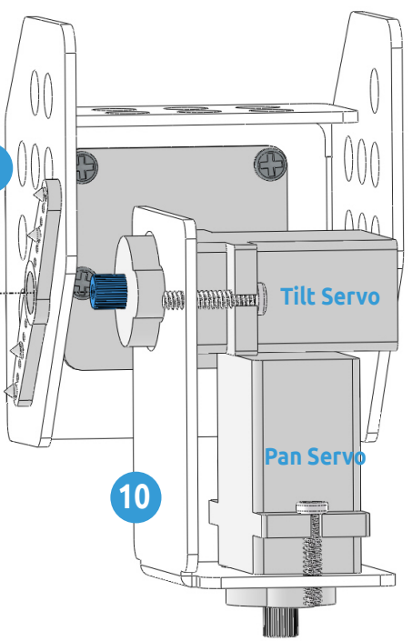

PiCar-Xを動かす
========================

これは初めてのプロジェクトです。まず、PiCar-Xの基本的な動きをテストしましょう。

**コードを実行する**

.. raw:: html

    <run></run>

.. code-block::

    cd ~/picar-x/example
    sudo python3 move.py

このコードを実行すると、PiCar-Xは前進し、S字カーブで曲がり、停止してから頭を振ります。

**コード**

.. note::
    下のコードは **変更/リセット/コピー/実行/停止** ができます。しかし、それをする前に、 ``picar-x/example`` のようなソースコードのパスに移動する必要があります。コードを変更した後、その効果を直接見るために実行することができます。

.. raw:: html

    <run></run>

.. code-block:: python

    from picarx import Picarx
    import time

    if __name__ == "__main__":
        try:
            px = Picarx()
            px.forward(30)
            time.sleep(0.5)
            for angle in range(0,35):
                px.set_dir_servo_angle(angle)
                time.sleep(0.01)
            for angle in range(35,-35,-1):
                px.set_dir_servo_angle(angle)
                time.sleep(0.01)        
            for angle in range(-35,0):
                px.set_dir_servo_angle(angle)
                time.sleep(0.01)
            px.forward(0)
            time.sleep(1)

            for angle in range(0,35):
                px.set_camera_servo1_angle(angle)
                time.sleep(0.01)
            for angle in range(35,-35,-1):
                px.set_camera_servo1_angle(angle)
                time.sleep(0.01)        
            for angle in range(-35,0):
                px.set_camera_servo1_angle(angle)
                time.sleep(0.01)
            for angle in range(0,35):
                px.set_camera_servo2_angle(angle)
                time.sleep(0.01)
            for angle in range(35,-35,-1):
                px.set_camera_servo2_angle(angle)
                time.sleep(0.01)        
            for angle in range(-35,0):
                px.set_camera_servo2_angle(angle)
                time.sleep(0.01)
                
        finally:
            px.forward(0)

**どのように動作するのか？**

Parkerの基本機能は ``picarx`` モジュールにあり、
操舵装置やホイールを制御するために使用できます。
そして、PiCar-Xを前進させたり、S字カーブで曲げたり、頭を振らせることができます。

現在、PiCar-Xの基本機能をサポートするライブラリがインポートされています。これらの行は、PiCar-Xの動きに関連するすべての例に表示されます。

.. code-block:: python
    :emphasize-lines: 0

    from picarx import Picarx
    import time

次に、 ``for`` ループを使用した以下の関数は、PiCar-Xを前進させ、方向を変え、カメラのパン/チルトを動かすために使用されます。

.. code-block:: python

    px.forward(speed)    
    px.set_dir_servo_angle(angle)
    px.set_camera_servo1_angle(angle)
    px.set_camera_servo2_angle(angle)

* ``forward()``: PiCar-Xに指定した ``speed`` で前進するように命令します。
* ``set_dir_servo_angle``: 指定した ``angle`` で操舵サーボを回転させます。
* ``set_camera_servo1_angle``: 指定した ``angle`` でパンサーボを回転させます。
* ``set_camera_servo2_angle``: 指定した ``angle`` でチルトサーボを回転させます。

