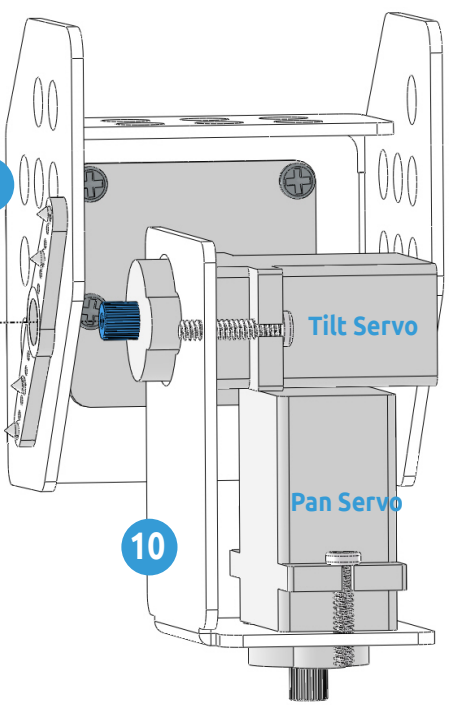

.. note::

    ¡Hola! Bienvenido a la comunidad de entusiastas de SunFounder Raspberry Pi, Arduino y ESP32 en Facebook. ¡Profundiza en el mundo de Raspberry Pi, Arduino y ESP32 junto con otros entusiastas!

    **¿Por qué unirse?**

    - **Soporte experto**: Resuelve problemas postventa y desafíos técnicos con la ayuda de nuestra comunidad y equipo.
    - **Aprende y comparte**: Intercambia consejos y tutoriales para mejorar tus habilidades.
    - **Preestrenos exclusivos**: Obtén acceso anticipado a anuncios de nuevos productos y adelantos.
    - **Descuentos especiales**: Disfruta de descuentos exclusivos en nuestros productos más recientes.
    - **Promociones festivas y sorteos**: Participa en sorteos y promociones especiales.

    👉 ¿Listo para explorar y crear con nosotros? Haz clic en [|link_sf_facebook|] y únete hoy.

.. _py_move:

2. Haz que PiCar-X se mueva
===========================

Este es el primer proyecto, vamos a probar los movimientos básicos del PiCar-X.

**Ejecutar el Código**

.. raw:: html

    <run></run>

.. code-block::

    cd ~/picar-x/example
    sudo python3 2.move.py

Después de ejecutar el código, PiCar-X avanzará, girará en forma de S, se detendrá y moverá la cabeza.

**Código**

.. note::
    Puedes **Modificar/Restablecer/Copiar/Ejecutar/Detener** el código a continuación. Pero antes de eso, debes ir a la ruta del código fuente como ``picar-x/example``. Después de modificar el código, puedes ejecutarlo directamente para ver el efecto.

.. raw:: html

    <run></run>

.. code-block:: python

    from picarx import Picarx
    import time

    if __name__ == "__main__":
        try:
            px = Picarx()
            px.forward(30)
            time.sleep(0.5)
            for angle in range(0,35):
                px.set_dir_servo_angle(angle)
                time.sleep(0.01)
            for angle in range(35,-35,-1):
                px.set_dir_servo_angle(angle)
                time.sleep(0.01)        
            for angle in range(-35,0):
                px.set_dir_servo_angle(angle)
                time.sleep(0.01)
            px.forward(0)
            time.sleep(1)

            for angle in range(0,35):
                px.set_camera_servo1_angle(angle)
                time.sleep(0.01)
            for angle in range(35,-35,-1):
                px.set_camera_servo1_angle(angle)
                time.sleep(0.01)        
            for angle in range(-35,0):
                px.set_camera_servo1_angle(angle)
                time.sleep(0.01)
            for angle in range(0,35):
                px.set_camera_servo2_angle(angle)
                time.sleep(0.01)
            for angle in range(35,-35,-1):
                px.set_camera_servo2_angle(angle)
                time.sleep(0.01)        
            for angle in range(-35,0):
                px.set_camera_servo2_angle(angle)
                time.sleep(0.01)
                
        finally:
            px.forward(0)

**¿Cómo funciona?**

La funcionalidad básica del PiCar-X está en el módulo ``picarx``, 
que se usa para controlar los servos de dirección y las ruedas, 
haciendo que PiCar-X avance, gire en forma de S o mueva su cabeza.

Ahora, las librerías que permiten la funcionalidad básica de PiCar-X se importan. 
Estas líneas aparecerán en todos los ejemplos que involucren el movimiento del PiCar-X.

.. code-block:: python
    :emphasize-lines: 0

    from picarx import Picarx
    import time

La siguiente función con el bucle ``for`` se usa para hacer que PiCar-X 
avance, cambie de dirección y mueva la cámara en los ejes de pan/tilt.

.. code-block:: python

    px.forward(speed)    
    px.set_dir_servo_angle(angle)
    px.set_camera_servo1_angle(angle)
    px.set_camera_servo2_angle(angle)

* ``forward()``: Ordena al PiCar-X avanzar a una velocidad ``speed`` específica.
* ``set_dir_servo_angle``: Gira el servo de dirección a un ``ángulo`` específico.
* ``set_cam_pan_angle``: Gira el servo de paneo a un ``ángulo`` específico.
* ``set_cam_tilt_angle``: Gira el servo de inclinación a un ``ángulo`` específico.

