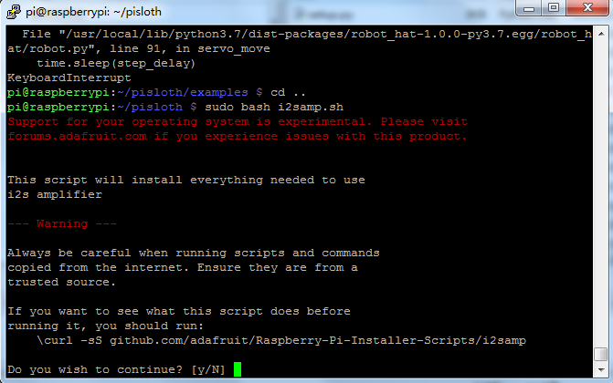
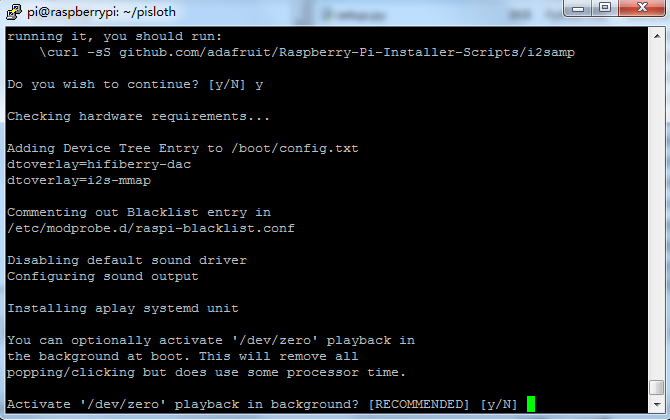
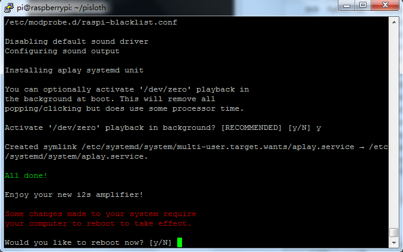

.. note::

    Bonjour et bienvenue dans la communauté Facebook des passionnés de Raspberry Pi, Arduino et ESP32 de SunFounder ! Plongez-vous dans l'univers du Raspberry Pi, Arduino et ESP32 avec d'autres passionnés.

    **Pourquoi nous rejoindre ?**

    - **Support d'experts** : Résolvez vos problèmes après-vente et relevez les défis techniques grâce à l'aide de notre communauté et de notre équipe.
    - **Apprenez & Partagez** : Échangez des astuces et des tutoriels pour améliorer vos compétences.
    - **Aperçus exclusifs** : Bénéficiez d'un accès anticipé aux annonces de nouveaux produits et à des avant-premières.
    - **Remises spéciales** : Profitez de réductions exclusives sur nos nouveaux produits.
    - **Promotions festives et concours** : Participez à des tirages au sort et à des promotions durant les fêtes.

    👉 Prêt à explorer et à créer avec nous ? Cliquez sur [|link_sf_facebook|] et rejoignez-nous dès aujourd'hui !

.. _install_all_modules:

5. Installer Tous les Modules (Important)
===========================================

Assurez-vous d’être connecté à Internet et mettez votre système à jour :

.. raw:: html

    <run></run>

.. code-block::

    sudo apt update
    sudo apt upgrade

.. note::

    Si vous utilisez la version **Lite** de Raspberry Pi OS, vous devez installer les paquets liés à Python3.

    .. raw:: html

        <run></run>

    .. code-block::

        sudo apt install git python3-pip python3-setuptools python3-smbus

----

Installer le module ``robot-hat``.

.. raw:: html

    <run></run>

.. code-block::

    cd ~/
    git clone -b 2.5.x https://github.com/sunfounder/robot-hat.git --depth 1
    cd robot-hat
    sudo python3 install.py

----

Télécharger et installer le module ``vilib``.

.. raw:: html

    <run></run>

.. code-block::

    cd ~/
    git clone https://github.com/sunfounder/vilib.git --depth 1
    cd vilib
    sudo python3 install.py

----

Télécharger et installer le module ``picar-x``.

.. raw:: html

    <run></run>

.. code-block::

    cd ~/
    git clone -b 2.1.x https://github.com/sunfounder/picar-x.git --depth 1
    cd picar-x
    sudo pip3 install . --break

> ⏳ Cette étape peut prendre un certain temps, soyez patient.

----

Enfin, vous devez exécuter le script ``i2samp.sh`` pour installer les composants nécessaires à l’amplificateur i2s.  
Sans cela, la PiCar-X **n’aura pas de son**.

.. raw:: html

    <run></run>

.. code-block::

    cd ~/robot-hat
    sudo bash i2samp.sh

Tapez **y** puis appuyez sur Entrée pour continuer.

Tapez **y** et appuyez sur Entrée pour exécuter ``/dev/zero`` en arrière-plan.

Tapez **y** et appuyez sur Entrée pour redémarrer la PiCar-X.

.. note::

    Si vous n’entendez toujours aucun son après le redémarrage, il peut être nécessaire d’exécuter le script ``i2samp.sh`` plusieurs fois.
