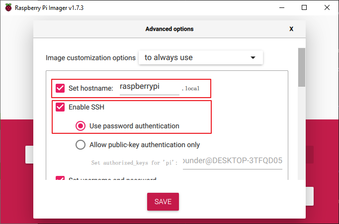
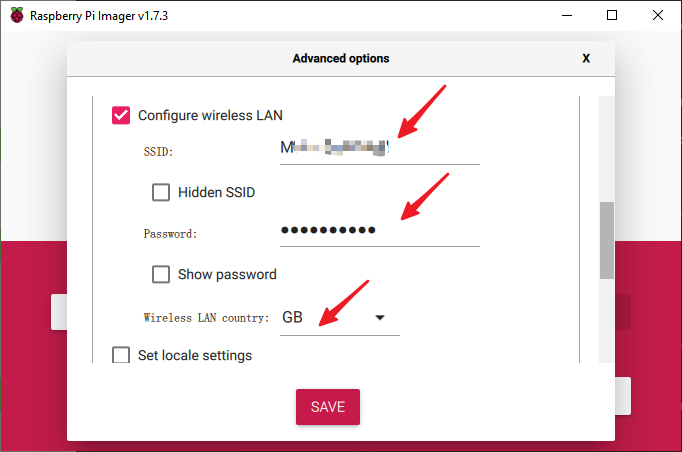
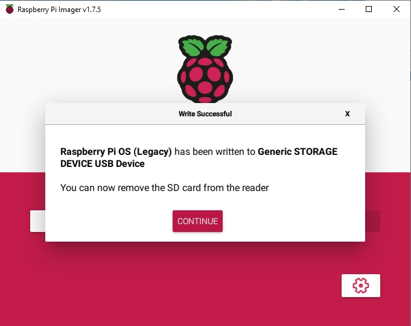

安装操作系统
========================

**必需组件**

================== ======================
任意树莓派           1 \* 个人计算机
1 \* 微型 SD 卡
================== ======================

**第1步**

树莓派开发了一个图形 SD 卡写入工具，适用于 Mac OS、Ubuntu 18.04 和 Windows，对于大多数用户来说是最简单的选择，因为它会下载映像并将其自动安装到 SD 卡。

访问下载页面：https://www.raspberrypi.org/software/。 单击与您的操作系统匹配的 Raspberry Pi Imager 链接，下载完成后，单击它以启动安装程序。

.. image:: img/image11.png
    :align: center

**第2步**

当您启动安装程序时，您的操作系统可能会尝试阻止您运行它。 例如，在 Windows 上，我收到以下消息：

如果出现此消息，请点击 **更多信息** ，然后点击 **仍然运行** ，然后按照说明安装 Raspberry Pi Imager。

.. image:: img/image12.png
    :align: center

**第3步**

将 SD 卡插入计算机或笔记本电脑的 SD 卡插槽。

**第4步**

.. In the Raspberry Pi Imager, select the OS that you want to install and
.. the SD card you would like to install it on.

.. .. image:: img/image13.png
..     :align: center

.. .. note:: 

..     1) You will need to be connected to the internet the first time.

..     2) That OS will then be stored for future offline use(lastdownload.cache, C:/Users/yourname/AppData/Local/Raspberry Pi/Imager/cache). So the next time you open the software, it will have the display "Released: date, cached on your computer".

.. 下载 `raspios_armhf-2020-05-28 <https://downloads.raspberrypi.org/raspios_armhf/images/raspios_armhf-2021-05-28/2021-05-07-raspios-buster-armhf.zip>`_ 镜像 并在 Raspberry Pi Imager 中选择它。

.. .. image:: img/otherOS.png
..     :align: center

.. .. warning::
..     树莓派操作系统在2021-05-28版本后有较大变化，可能会导致部分功能不可用。 请暂时不要使用最新版本。

.. warning::

    Raspberry Pi OS升级到 **Debian Bullseye** 后，会导致有些功能不能使用，建议还是继续使用 **Debian Buster** 版本。

在Raspberry Pi Imager中，点击 **CHOOSE OS** -》 **Raspberry Pi OS(other)**。

.. image:: img/3d33.png
    :align: center

将新打开的页下拉到最后面，你会看到 **Raspberry Pi OS(Legacy)** 和 **Raspberry Pi OS Lite(Legacy)**，这2个是对Debian Buster安全更新，它们之间的区别是带不带桌面。
建议安装 **Raspberry Pi OS(Legacy)**，这个带桌面的系统。

.. image:: img/3d34.png
    :align: center

**第5步**

选择您正在使用的 SD 卡。

.. image:: img/image14.png
    :align: center

**第6步**

按 **Ctrl+Shift+X** 或者点击 **设置** 按钮来打开 **高级选项** 页面启用SSH和配置wifi，这2项必须设置，其他取决于你的选择。 您可以选择始终使用此图像自定义选项。

然后向下滚动以完成 wifi 配置并单击 **SAVE** 。

.. note::

    **wifi country** 选择 **CN**。

**第7步**

单击 **WRITE** 按钮。

.. image:: img/image17.png
    :align: center

**第8步**

如果您的 SD 卡上当前有任何文件，您可能希望先备份这些文件以防止永久丢失它们。 如果没有要备份的文件，请单击 **YES**。

.. image:: img/image18.png
    :align: center

**第9步**

等待一段时间后，会出现如下窗口，代表写入完成。

