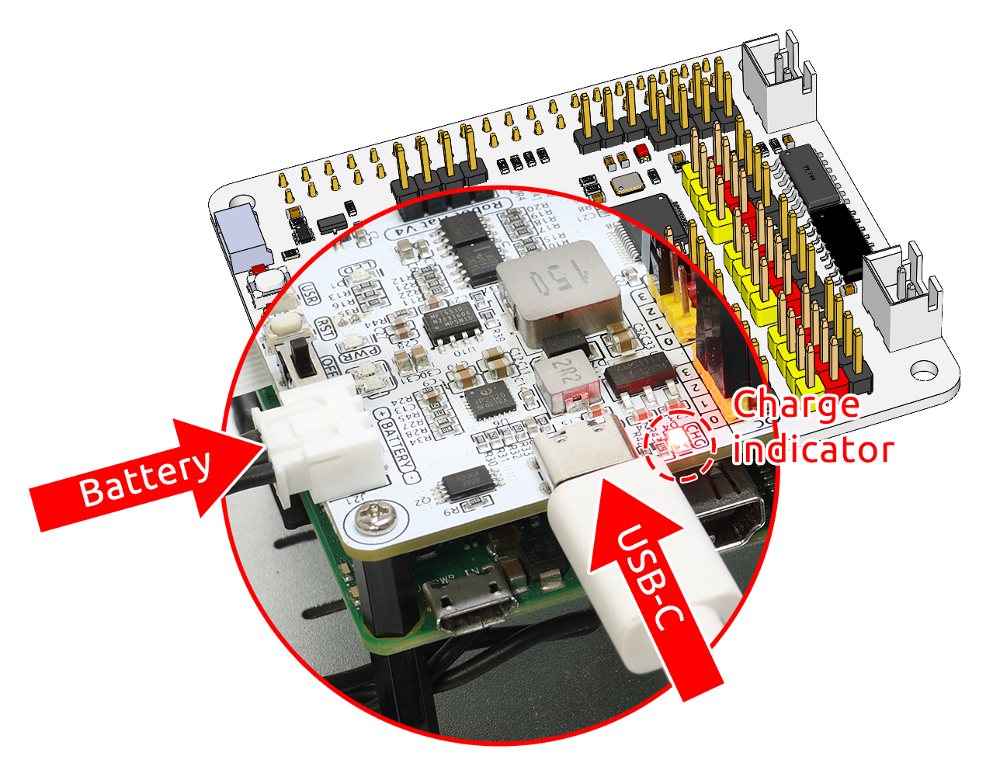
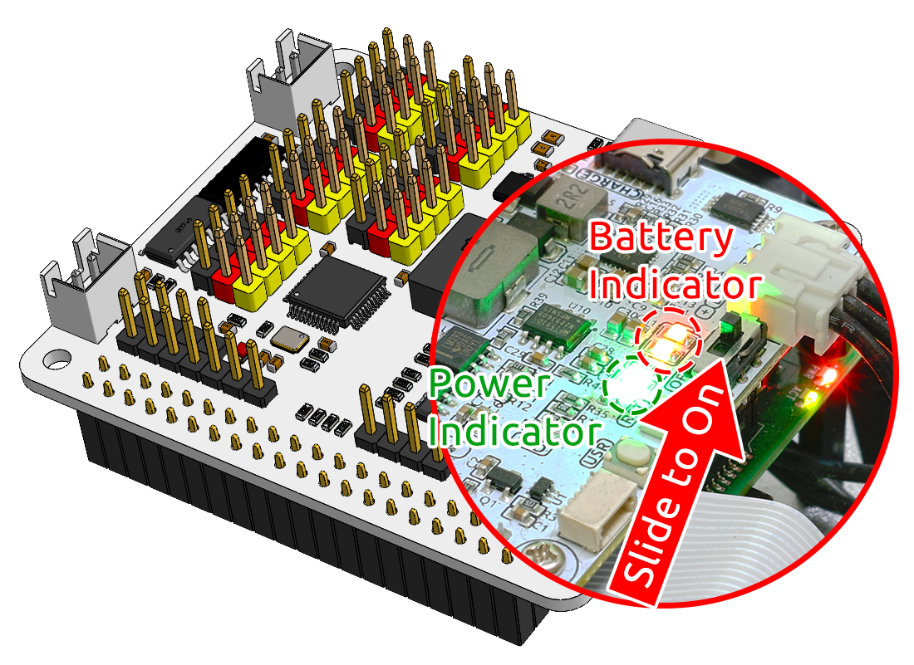

.. note::

    Ciao, benvenuto nella SunFounder Raspberry Pi & Arduino & ESP32 Enthusiasts Community su Facebook! Approfondisci le tue conoscenze su Raspberry Pi, Arduino e ESP32 insieme ad altri appassionati.

    **Perché unirti a noi?**

    - **Supporto Esperto**: Risolvi i problemi post-vendita e le sfide tecniche con l'aiuto della nostra comunità e del nostro team.
    - **Impara e Condividi**: Scambia suggerimenti e tutorial per migliorare le tue competenze.
    - **Anteprime Esclusive**: Ottieni accesso anticipato agli annunci di nuovi prodotti e alle anteprime.
    - **Sconti Speciali**: Approfitta di sconti esclusivi sui nostri prodotti più recenti.
    - **Promozioni e Giveaway Festivi**: Partecipa a promozioni e concorsi durante le festività.

    👉 Sei pronto a esplorare e creare con noi? Clicca [|link_sf_facebook|] e unisciti oggi stesso!

3. Alimentazione per Raspberry Pi (Importante)
=====================================================

Carica
-------------------

Inserisci il cavo della batteria. Successivamente, inserisci il cavo USB-C per caricare la batteria.
Dovrai utilizzare un tuo caricatore; consigliamo un caricatore da 5V 3A, oppure il caricatore del tuo smartphone andrà bene.

.. note::
    Collega una fonte di alimentazione esterna Type-C alla porta Type-C del robot hat; inizierà immediatamente a caricare la batteria e si accenderà una spia rossa.\
    Quando la batteria sarà completamente carica, la spia rossa si spegnerà automaticamente.

Accensione
----------------------

Accendi l'interruttore di alimentazione. La spia di alimentazione e l'indicatore di livello della batteria si accenderanno.

Attendi qualche secondo e sentirai un leggero bip, che indicherà che il Raspberry Pi si è avviato correttamente.

.. note::
    Se entrambe le spie dell'indicatore di livello della batteria sono spente, carica la batteria.
    Quando hai bisogno di sessioni prolungate di programmazione o debug, puoi mantenere operativo il Raspberry Pi inserendo il cavo USB-C per caricare la batteria contemporaneamente.

