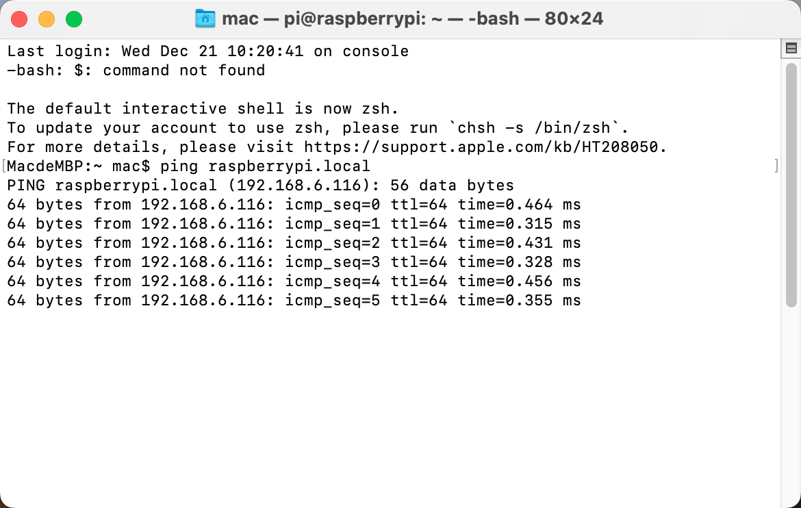
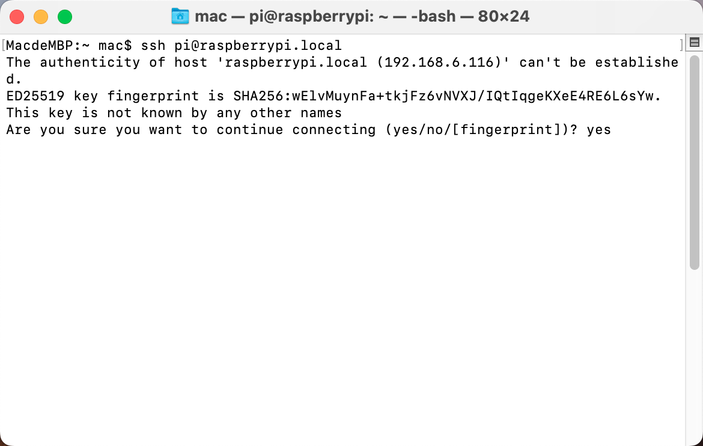
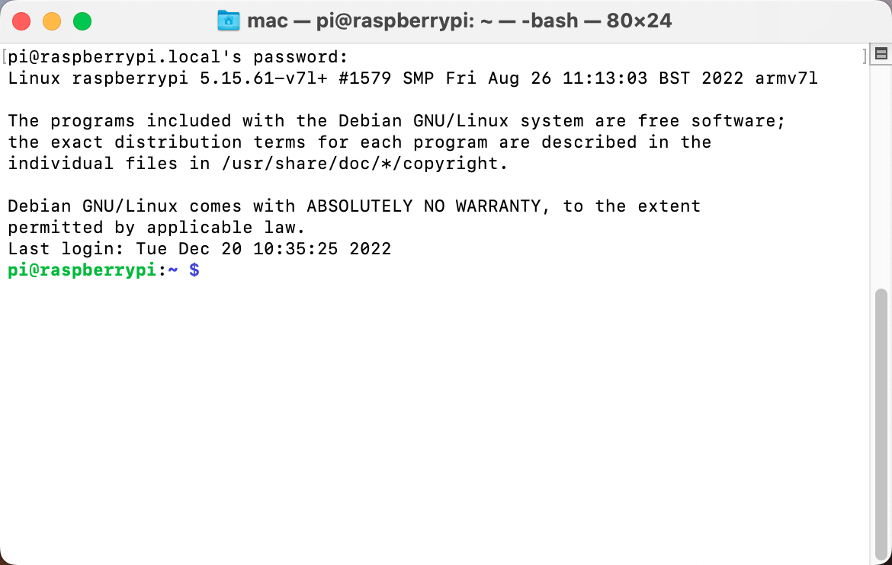
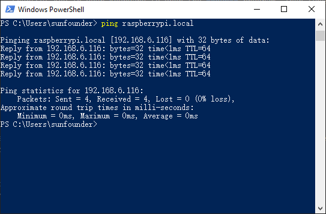

Set up Your Raspberry Pi
============================

If You Have a Screen
-------------------------

If you have a screen, it will be easy for you to operate on the
Raspberry Pi.

**Required Components**

* Any Raspberry Pi   
* 1 * Power Adapter
* 1 * Micro SD card
* 1 * Screen Power Adapter
* 1 * HDMI cable
* 1 * Screen
* 1 * Mouse
* 1 * Keyboard

1. Insert the SD card you’ve set up with Raspberry Pi OS into the micro SD card slot on the underside of your Raspberry Pi.

#. Plug in the Mouse and Keyboard.

#. Connect the screen to Raspberry Pi’s HDMI port and make sure your screen is plugged into a wall socket and switched on.

    .. note::

        If you use a Raspberry Pi 4, you need to connect the screen to the HDMI0 (nearest the power in port).

#. Use the power adapter to power the Raspberry Pi. After a few seconds, the Raspberry Pi OS desktop will be displayed.

    .. image:: img/image20.png
        :align: center

If You Have No Screen
--------------------------

If you don’t have a display, you can log in to the Raspberry Pi remotely. 

We can open the Bash Shell of Raspberry Pi by applying SSH. Bash is the
standard default shell of Linux. The Shell itself is a program written
in C that is the bridge linking the customers and Unix/Linux. Moreover,
it can help to complete most of the work needed.

**For Linux or/Mac OS X Users**

1. Go to **Applications**->\ **Utilities**, find the **Terminal**, and open
it.

.. image:: img/image21.png
    :align: center

2. Check if your Raspberry Pi is on the same network by type in ``ping <hostname>.local``. 

.. code-block::

    ping raspberrypi.local

* If terminal prompts ``ping: cannot resolve <hostname>.local``, it is possible that the Raspberry Pi failed to connect to the network. Please check the network.
* If you really can't ping ``<hostname>.local``, try to :ref:`get_ip`  and ``ping <IP address>`` instead. (e.g., ``ping 192.168.6.116``)
* If multiple prompts like ``64 bytes from <IP address>: icmp_seq=0 ttl=64 time=0.464 ms`` appear, it means your computer can access the Raspberry Pi.

3. Type in ``ssh <username>@<hostname>.local`` (or ``ssh <username>@<IP address>``).

.. code-block::

    ssh pi@raspberrypi.local

4. The following message may appear.

.. code-block::

    The authenticity of host 'raspberrypi.local (192.168.6.116)' can't be established.
    ECDSA key fingerprint is SHA256:7ggckKZ2EEgS76a557cddfxFNDOBBuzcJsgaqA/igz4.
    Are you sure you want to continue connecting (yes/no/[fingerprint])? 

Input \"yes\".

5. Input the password you set before. (Mine is ``raspberry``.)

.. .. image:: img/image23.png
..     :align: center

.. note::
    When you input the password, the characters do not display on
    window accordingly, which is normal. What you need is to input the
    correct password.

6. We now get the Raspberry Pi connected and are ready to go to the next
step.

**For Windows Users**

If you're a Windows user, you can use Windows PowerShell.

1. Press the ``windows`` + ``R`` shortcut key in your keyboard to open the **Run** program. Then type **powershell** in the input box. 

.. image:: img/sp221221_135900.png
    :align: center

2. Check if your Raspberry Pi is on the same network by type in ``ping <hostname>.local``. 

.. code-block::

    ping raspberrypi.local

* If terminal prompts ``Ping request could not find host <hostname>.local``, it is possible that the Raspberry Pi failed to connect to the network.lease check the network.
* If you really can't ping ``<hostname>.local``, try to :ref:`get_ip`  and ``ping <IP address>`` instead. (e.g., ``ping 192.168.6.116``)
* If multiple prompts like "Reply from <IP address>: bytes=32 time<1ms TTL=64" appear, it means your computer can access the Raspberry Pi.

    
3. Type in ``ssh <username>@<hostname>.local`` (or ``ssh <username>@<IP address>``).

.. code-block::

    ssh pi@raspberrypi.local

4. The following message may appear.

.. code-block::

    The authenticity of host 'raspberrypi.local (192.168.6.116)' can't be established.
    ECDSA key fingerprint is SHA256:7ggckKZ2EEgS76a557cddfxFNDOBBuzcJsgaqA/igz4.
    Are you sure you want to continue connecting (yes/no/[fingerprint])? 

Input \"yes\".

5. Input the password you set before. (Mine is ``raspberry``.)

.. note::
    When you input the password, the characters do not display on
    window accordingly, which is normal. What you need is to input the
    correct password.

6. We now get the Raspberry Pi connected and are ready to go to the next
step.

.. image:: img/sp221221_140628.png
    :width: 550
    :align: center

.. you can use SSH with the application of some
.. software. Here, we recommend **PuTTY**.

.. **Step 1**

.. Download PuTTY.

.. **Step 2**

.. Open PuTTY and click **Session** on the left tree-alike structure. Enter
.. the IP address of the RPi in the text box under **Host Name (or IP
.. address)** and **22** under **Port** (by default it is 22).

.. .. image:: img/image25.png
..     :align: center

.. **Step 3**

.. Click **Open**. Note that when you first log in to the Raspberry Pi with
.. the IP address, there prompts a security reminder. Just click **Yes**.

.. **Step 4**

.. When the PuTTY window prompts \"**login as:**\", type in
.. \"**pi**\" (the user name of the RPi), and **password:** \"raspberry\"
.. (the default one, if you haven't changed it).

.. .. note::

..     When you input the password, the characters do not display on window accordingly, which is normal. What you need is to input the correct password.
    
..     If inactive appears next to PuTTY, it means that the connection has been broken and needs to be reconnected.
    
.. .. image:: img/image26.png
..     :align: center

.. **Step 5**

.. Here, we get the Raspberry Pi connected and it is time to conduct the next steps.

.. note::

    If you are not satisfied with using the command window to control the Raspberry Pi, you can also use the remote desktop function, which can help us manage the files in the Raspberry Pi easily.

    For details on how to do this, please refer to :ref:`remote_desktop`.
