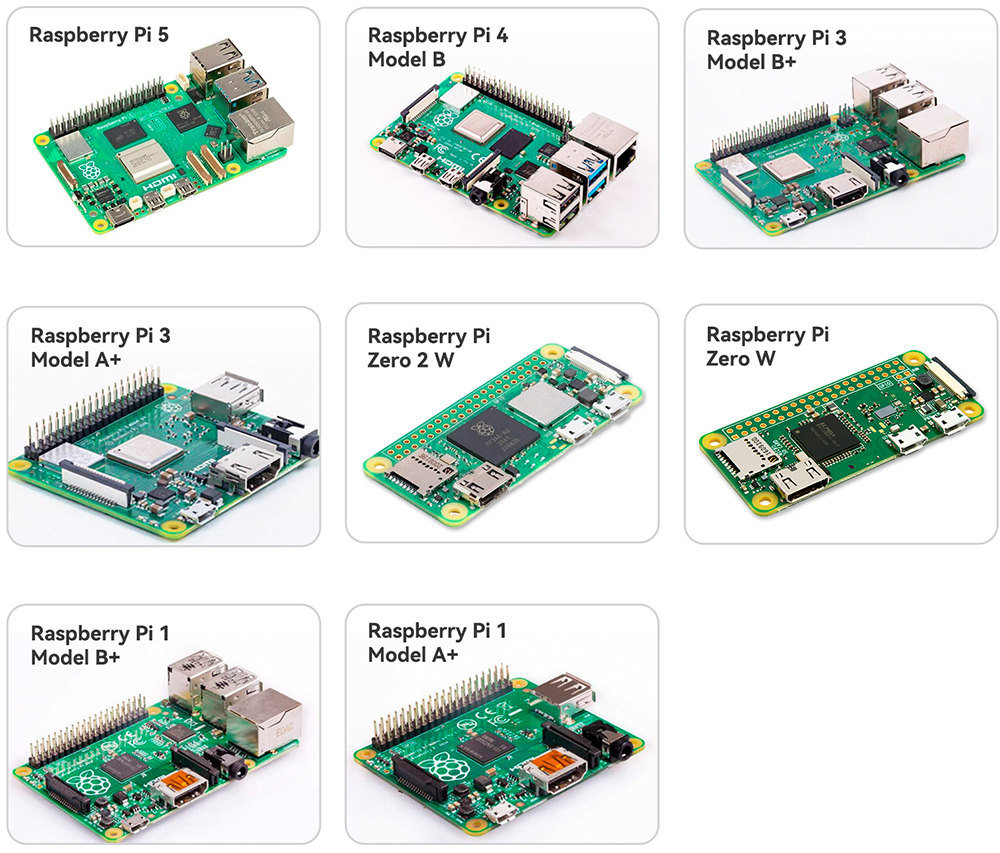

.. note::

    Bonjour et bienvenue dans la communauté Facebook des passionnés de Raspberry Pi, Arduino et ESP32 de SunFounder ! Plongez-vous dans l'univers du Raspberry Pi, Arduino et ESP32 avec d'autres passionnés.

    **Pourquoi nous rejoindre ?**

    - **Support d'experts** : Résolvez vos problèmes après-vente et relevez les défis techniques grâce à l'aide de notre communauté et de notre équipe.
    - **Apprenez & Partagez** : Échangez des astuces et des tutoriels pour améliorer vos compétences.
    - **Aperçus exclusifs** : Bénéficiez d'un accès anticipé aux annonces de nouveaux produits et à des avant-premières.
    - **Remises spéciales** : Profitez de réductions exclusives sur nos nouveaux produits.
    - **Promotions festives et concours** : Participez à des tirages au sort et à des promotions durant les fêtes.

    👉 Prêt à explorer et à créer avec nous ? Cliquez sur [|link_sf_facebook|] et rejoignez-nous dès aujourd'hui !

1. De quoi avons-nous besoin ?
=================================

Composants requis
--------------------

**Raspberry Pi**

Le Raspberry Pi est un ordinateur de la taille d'une carte de crédit, à
faible coût, qui se connecte à un moniteur ou une télévision et utilise
un clavier et une souris standard. C'est un petit appareil puissant qui
permet aux personnes de tout âge d'explorer l'informatique et d'apprendre
à programmer dans des langages comme Scratch et Python.

**Adaptateur secteur**

Pour se connecter à une prise de courant, le Raspberry Pi possède un port
micro USB (similaire à celui que l'on trouve sur de nombreux téléphones
portables). Vous aurez besoin d'une alimentation fournissant au moins
2,5 ampères.

**Carte Micro SD**

Votre Raspberry Pi a besoin d'une carte Micro SD pour stocker tous ses 
fichiers et le système d'exploitation Raspberry Pi OS. Vous aurez besoin 
d'une carte Micro SD d'une capacité d'au moins 8 Go.

Composants optionnels
-------------------------

**Écran**

Pour voir l'environnement de bureau du Raspberry Pi, vous devez utiliser
un écran, qu'il s'agisse d'un téléviseur ou d'un moniteur d'ordinateur. Si
l'écran est équipé de haut-parleurs intégrés, le Pi pourra émettre des
sons via ceux-ci.

**Souris & Clavier**

Lorsque vous utilisez un écran, un clavier USB et une souris USB sont également nécessaires.

**HDMI**

Le Raspberry Pi dispose d'un port de sortie HDMI compatible avec les
ports HDMI de la plupart des téléviseurs et moniteurs modernes. Si votre
écran ne dispose que de ports DVI ou VGA, vous devrez utiliser un câble de conversion approprié.

**Boîtier**

Vous pouvez placer le Raspberry Pi dans un boîtier pour protéger votre appareil.

**Son ou casque**

Le Raspberry Pi est équipé d'une prise audio de 3,5 mm qui peut être utilisée si votre écran ne dispose pas de haut-parleurs intégrés ou si vous n'utilisez pas d'écran.
