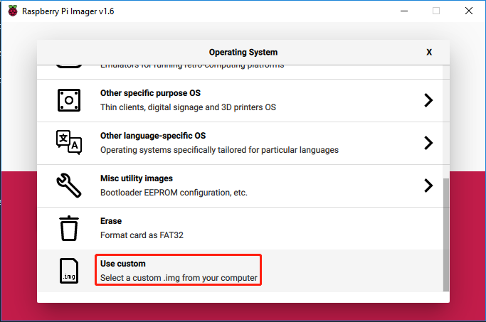

Ezblock 快速指南
============================

这里有两个部分：

* :ref:`组装帕克之前` 允许您将所有舵机保持在 0 度以完成正确和安全的装配（否则您可能会损坏舵机）。
* :ref:`Ezblock 编程前` 将指导您下载 Ezblock Studio 与您的机器人一起玩。

组装帕克之前
--------------------------------

在组装帕克之前，请按照此处有关如何在 Micro SD 卡上安装 Ezblock 的说明进行操作： 

.. `下载并安装 Ezblock <https://docs.sunfounder.com/projects/ezblock3/en/latest/quick_user_guide_for_ezblock3 .html#download-and-install-ezblock-os>`_.

**第1步**

树莓派开发了一个图形 SD 卡写入工具，适用于 Mac OS、Ubuntu 18.04 和 Windows，对于大多数用户来说是最简单的选择，因为它会下载映像并将其自动安装到 SD 卡。

访问下载页面：https://www.raspberrypi.org/software/。 单击与您的操作系统匹配的 Raspberry Pi Imager 链接，下载完成后，单击它以启动安装程序。

.. image:: preparation/media/image11.png
    :align: center

**第2步**

当您启动安装程序时，您的操作系统可能会尝试阻止您运行它。 例如，在 Windows 上，我收到以下消息：

如果出现此消息，请点击 **更多信息** ，然后点击 **仍然运行** ，然后按照说明安装 Raspberry Pi Imager。

.. image:: preparation/media/image12.png
    :align: center

**第3步**

将 SD 卡插入计算机或笔记本电脑的 SD 卡插槽。

**第4步**

下载 `Ezblock 镜像 <https://1drv.ms/u/s!AqKAi6T8L7jzjBG4sb3luhQUhW_c?e=CCXYtt>`_ 。

**第5步**

在 Raspberry Pi Imager 中选择刚下载的 Ezblock 镜像。

**第6步**

选择您正在使用的 SD 卡。

.. image:: preparation/media/image14.png
    :align: center

**第7步**

单击 **WRITE** 按钮。

.. image:: preparation/media/image17.png
    :align: center

**第8步**

如果您的 SD 卡上当前有任何文件，您可能希望先备份这些文件以防止永久丢失它们。 如果没有要备份的文件，请单击 **YES**。

.. image:: preparation/media/image18.png
    :align: center

**第9步**

等待一段时间后，会出现如下窗口，代表写入完成。

.. image:: preparation/media/image19.png
    :align: center

在Micro SD卡上烧录Ezblock镜像后，你将可以设置Robot HAT上的P11口将舵机角度校准为0°角。 为确保舵机已正确设置为 0°，首先将摇臂轻轻插入舵机轴，然后将摇臂轻轻旋转到不同的角度。

.. image:: img/servo_arm.png

接下来，将伺服电缆插入 P11 端口，如下所示：

.. image:: img/pin11_connect.png
    :width: 600

打开机器人HAT的 **电源开关**，舵机臂应回到0°位置。 如果伺服臂没有返回到 0°，请按 **RST** 按钮重新启动机器人 HAT。

.. note::
    在连接每个舵机之前，将舵机电缆插入 P11 并打开电源，将舵机设置为 0°。
    向 Micro SD 卡写入任何程序后，此功能将失效。

Ezblock 编程前
---------------------

扫描下方二维码，下载 Ezblock Studio APP。

.. note::

    连接帕克后，会有一个校准步骤。 这是因为安装过程中可能存在偏差或舵机本身的限制，导致一些舵机角度略微倾斜，因此您可以在此步骤中对其进行校准。
    
    但如果你认为组装很完美，不需要校准，你也可以跳过这一步。
