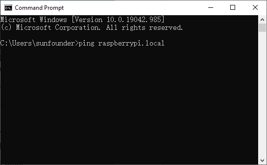
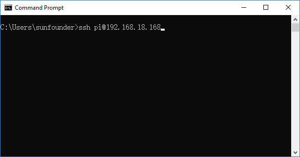
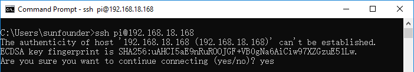
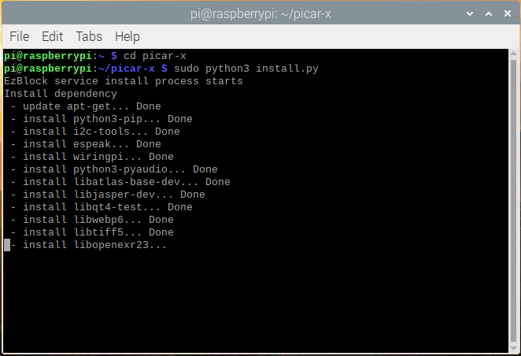

Quick Guide on Python
==========================

This section reviews how to install the Raspberry Pi OS, configure the WiFi settings on a Raspberry Pi, and how to remote access the Raspberry Pi to run code and create programs.

For users familiar with Raspberry Pi enough to open the command line interface, please ignore the first three parts of this section and skip ahead to :ref:`download_code` , :ref:`run_install.py` and :ref:`run_servo_zeroing.py`. 

* :ref:`install_raspberry_pi_os`
* :ref:`configure_wifi_file`
* :ref:`remote_access_by_ssh`
* :ref:`download_code`
* :ref:`run_install.py`
* :ref:`run_servo_zeroing.py`
  
.. note:: 

    The ``servo_zeroing.py`` is a Python program that enables the P11 port to output a stable square wave that will set the servo angle to 0°. This code needs to be run separately on each servo before assembly. 

.. _install_raspberry_pi_os:

Install the Raspberry Pi OS
-------------------------------
Prepare the following items:

* Personal computer
* Raspberry Pi
* Card reader
* SD card
* Power supply

1. Insert the Micro SD card (with card reader) into the PC and open `Raspberry Pi Imager <https://www.raspberrypi.org/downloads/>`_ .

    .. image:: img/RPi_imager.png

#. Click **CHOOSE OS** and Select the first one (Recommended for 32-bit systems) to download the Raspberry Pi OS.

    .. image:: img/RPi_imager2.png

#. Click **CHOOSE SD CARD** . At the prompt, select the Micro SD card inserted into the PC.
    
    .. image:: img/RPi_imager3.png

#. Click **WRITE** to burn the Rasbian OS onto the Micro SD card.

    .. image:: img/RPi_imager4.png

.. note::
    
    For full review of installing the Raspberry Pi OS, please reference the online documentation here: `Standard Installation <https://www.raspberrypi.org/documentation/installation/>`_.

.. note::

    For a detailed tutorial on how to launch Raspberry Pi and open a Terminal interface, please refer to: `Setting up your Raspberry Pi <https://projects.raspberrypi.org/en/projects/raspberry-pi-setting-up>`_.
    
    For users without a display attached to the Raspberry Pi, follow the instructions below to access the Raspberry Pi remotely from a PC.

.. _configure_wifi_file:

Configure Wi-Fi File
-----------------------------------------------

A ``wpa_supplicant.conf`` file will need to be created and configured for the users local wireless network. Put this file in the ``boot`` folder of the Raspberry Pi. When the Raspberry Pi first boots, it will copy that file into the correct location and use the settings in the file for wireless networking.

Depending on the operating system and text-editor, the file may have incorrect line breaks, or possibly an incorrect file extension. Linux expects the line feed (LF) newline character. For more information, reference the following article: `Newline Wikipedia <https://en.wikipedia.org/wiki/Newline>`_ .

If there are complications, SunFounder recommends using GNU Nano as a text editor.

.. image:: img/setup_python1.png

.. code-block:: 

    ctrl_interface=DIR=/var/run/wpa_supplicant GROUP=netdev  
    update_config=1  
    country=<Insert 2 letter ISO 3166-1 country code here>
    
    network={
        ssid="<Name of your wireless LAN>" 
        psk="< Password for your wireless LAN>"  
    }

.. warning::

    * More information on the ``wpa_supplicant.conf`` file can be found here: `Setting up a wireless LAN <https://www.raspberrypi.org/documentation/configuration/wireless/wireless-cli.md>`_. 
    * Reference `ISO_3166 - Wikipedia <https://en.wikipedia.org/wiki/ISO_3166-1>`_ for a list of 2 letter ISO 3166-1 country codes.
    * Some older wireless dongles do not support 5GHz networks.
    * For more ways to set up a wireless network, please reference `Wireless connectivity <https://www.raspberrypi.org/documentation/configuration/wireless/README.md>`_.

.. _remote_access_by_ssh:

Remote Access by SSH
------------------------------------

**Enabling SSH** 

Using SSH, the command line of a Raspberry Pi can be accessed remotely from another computer or device on the same network.

The Raspberry Pi will act as a remote device, and can be connected to by using a client service on another machine. This will provide access to the command line interface, but will not show the full Rasbian desktop environment.
When the Raspberry Pi OS is flashed onto a blank SD card, it will create two partitions. The first partition is the smaller one, and is used as the boot partition.

SSH can be enabled by placing a file simply named ``ssh``, without an extension, onto the boot partition of the SD card. When the Raspberry Pi boots, it will first look for an “ssh” file in the boot partition. If an “ssh” file is found, Rasbian will enable the SSH protocol, and then delete the “ssh” file. The contents of the file will not matter, just the name of the file needs to be “ssh”.

.. image:: img/ssh.png

When the Raspberry Pi OS is loaded onto a blank SD card,there will be two partitions. The first one, which is the smaller one, is the boot partition. Place the ssh file into this partition.

.. image:: img/boot_disk.png

Eject the Micro SD from the PC, then insert it into the Raspberry Pi, and then power on the Raspberry Pi.

**Find the Raspberry Pi’s IP address**

Any device connected to a Local Area Network is assigned an IP address. In order to connect to the Raspberry Pi from another machine using SSH, the Raspberry Pi’s IP address is needed.

On Raspberry Pi OS, **multicast DNS** is supported out-of-the-box by the Avahi service.

For PC’s that support multicast DNS, the Raspberry Pi can be reached by using a ``hostname`` and the ``.local`` suffix. The default hostname on a new Raspberry Pi OS install is ``raspberrypi``. By default, any Raspberry Pi running Raspberry Pi OS responds to:

.. code-block:: shell

    ping raspberrypi.local

If the Raspberry Pi is reachable, ping will show its IP address:

.. code-block:: shell

    Pinging raspberrypi.local [192.168.18.168] with 32 bytes of data:
    Reply from 192.168.18.168: bytes=32 time=54ms TTL=64
    Reply from 192.168.18.168: bytes=32 time=1ms TTL=64
    Reply from 192.168.18.168: bytes=32 time=1ms TTL=64
    Reply from 192.168.18.168: bytes=32 time=2ms TTL=64

    Ping statistics for 192.168.18.168:
        Packets: Sent = 4, Received = 4, Lost = 0 (0% loss),
    Approximate round trip times in milli-seconds:
        Minimum = 1ms, Maximum = 54ms, Average = 14ms

For more ways to find the IP address, please reference the following site: `IP Address <https://www.raspberrypi.org/documentation/remote-access/ip-address.md>`_.

**Remote Access using SSH**

SSH can be used to connect to a Raspberry Pi from a **Windows 10** computer with an **October 2018 Update or later** without having to use a third-party client software.

* For use SSH from a Linux computer or a Mac, please follow the instructions here: `SSH using Linux or Mac OS <https://www.raspberrypi.org/documentation/remote-access/ssh/unix.md>`_.
* For older version of Windows, please  please follow the instructions here: `SSH using Windows OS <https://www.raspberrypi.org/documentation/remote-access/ssh/windows.md>`_.

To connect to your Pi from a different computer, copy and paste the following command into the terminal window, but replace ``<IP>`` with the IP address of the Raspberry Pi.

.. code-block:: shell

    ssh pi@<IP>

When the connection is established, a security/authenticity warning will appear. Type ``yes`` to continue. This warning will only appear the first time a connection is established.

.. warning::

    In the event that the Raspberry Pi has taken the IP address of a device the PC has connected to before, even if the device was on a different network, a **warning** may appear, and request that the recorded IP from the list of known devices be cleared from memory. Follow the on-screen instructions to remove the cached IP address, and try to ssh into the Raspberry Pi again.

The next prompt will be for the user password. The default password for the Raspberry Pi OS is  ``raspberry``.

.. note::

  * The characters do not display when typing in the password. Make sure to input the correct password.
  * For security reasons it is highly recommended to change the default password on the Raspberry Pi. 

.. image:: img/ssh_pi_terminal.png

The Raspberry Pi prompt should now be displayed in the terminal window, which will be identical to the terminal on the Raspberry Pi itself. This confirms that the remote connection to the Raspberry Pi has been established, and commands can be executed through this terminal interface.

.. _download_code:

Download the PiCar-X Code Files
----------------------------------------

Download the PiCar-X files by using ``git clone`` in the command line.

First change the directory to **/home/pi/** via `cd command <https://en.wikipedia.org/wiki/Cd_(command)>`_ .

.. code-block:: shell

    cd /home/pi/

Then clone the repository from github via `git clone command <https://github.com/git-guides/git-clone>`_ .

.. code-block:: shell

    git clone -b v2.0 https://github.com/sunfounder/picar-x.git

.. _run_install.py:

Run install.py
-----------------------------------

Enter the following two commands to run the ``install.py`` file in the ``picar-x`` folder.

.. code-block:: shell

    cd picar-x

.. code-block:: shell

    sudo python3 install.py

The ``install.py`` file will finish the installation of the required Python libraries, and configure the Raspberry Pi for PiCar-X operations.

.. warning::
    
    The ``install.py`` program may encounter some **Errors** due to network connectivity. If there is an error prompt, please check the network and re-run ``install.py`` until all processes show **Done** and the prompt **Finished** appears at the end.

This step can take several minutes. After the file is fully executed and the prompt **Finished** appears, please restart the Raspberry Pi.

.. code-block:: shell

    sudo reboot

.. _run_servo_zeroing.py:

Run servo_zeroing.py on each servo
--------------------------------------
The servos are powered through the power supply on the Robot HAT, and will not work correctly if the Robot HAT is only powered through the Raspberry Pi. Make sure that the two batteries are placed correctly in the battery box, the battery box’s power cable is connected to the Robot HAT, and the Robot HAT is powered on.

Run the file ``servo_zeroing.py`` in the **example** folder.

.. code-block:: shell

    cd /home/pi/picar-x/example

.. code-block::  shell

    sudo python3 servo_zeroing.py

To make sure the servo has been correctly set to 0°, first insert a rocker arm in the servo shaft, and then slightly rotate the rocker arm to a different angle.

.. image:: img/servo_arm.png

Insert the servo cable into the P11 port as per the diagram below.

.. image:: img/pin11_connect.png
    :width: 600

Turn on the **Power Switch** to the Robot HAT, and the servo arm should return to the 0° position. If the servo arm does not return to 0°, press the **RST** button to restart the Robot HAT.

.. note::

    Before attaching each servo, plug the servo cable into P11 and turn the power on to set the servo to 0°.
