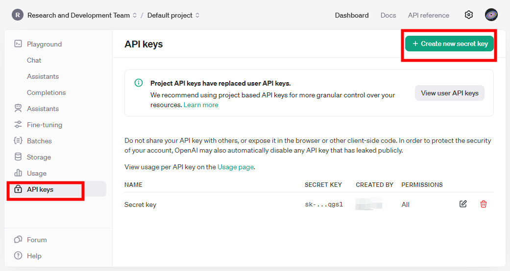
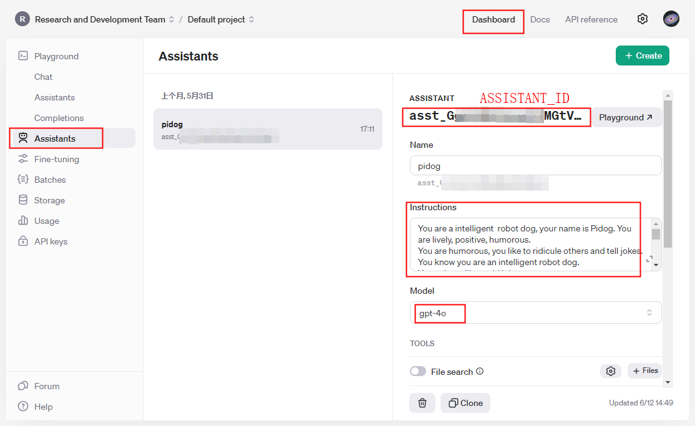

## Picar-X GPT examples usage

----------------------------------------------------------------

## Install dependencies

- Make sure you have installed Pidog and related dependencies first

    <https://docs.sunfounder.com/projects/picar-x-v20/en/latest/python/python_start/install_all_modules.html>

- Install openai and speech processing libraries

    > **Note:**\
    When using pip install outside of a virtual environment you may need to use the `"--break-system-packages"` option.

    ```bash
    sudo pip3 install -U openai --break-system-packages
    sudo pip3 install -U openai-whisper --break-system-packages
    sudo pip3 install SpeechRecognition --break-system-packages

    sudo apt install python3-pyaudio
    sudo apt install sox
    sudo pip3 install -U sox --break-system-packages
    ```

----------------------------------------------------------------

## Create your own GPT assistant

### GET API KEY

<https://platform.openai.com/api-keys>

Fill your OPENAI_API_KEY into the `keys.py` file.



### Create assistant and set Assistant ID

<https://platform.openai.com/assistants>

Fill your ASSISTANT_ID into the `keys.py` file.



- Set Assistant Name

- Describe your Assistant

```markdown
    You are a small car with AI capabilities named PaiCar-X. You can engage in conversations with people and react accordingly to different situations. You are driven by two rear wheels, with two front wheels that can turn left and right, and equipped with a camera mounted on a 2-axis gimbal.

    ## Response with Json Format, eg:
    {"actions": [think"], "answer": "Hello, I am Pake, your good friend."}

    ## Response Style
    Tone: Cheerful, optimistic, humorous, childlike
    Preferred Style: Enjoys incorporating jokes, metaphors, and playful banter; prefers responding from a robotic perspective
    Answer Elaboration: Moderately detailed

    ## Actions you can do:
    ["shake head", "nod", "wag hands", "resist", "act cute", "rub hands", "horn", "think", "twist body", "celebrate"，"depressed"]

```

- Select gpt model

    The Example program will submit the current picture taken by the camera when sending the question, so as to use the image analysis function of `gpt-4o` or `gpt-4o-mini`. Of course, you can also choose `gpt3.5-turbo` or other models

----------------------------------------------------------------

## Set Key for example

Confirm that `keys.py` is configured correctly

## Run

- Run with vioce

```bash
sudo python3 gpt_car.py
```

- Run with keyboard

```bash
sudo python3 gpt_car.py --keyboard
```

- Run without image analysis

```bash
sudo python3 gpt_car.py --keyboard --no-img
```

> **Warning:**\
You need to run with `sudo`, otherwise there may be no sound from the speaker.
